# 🎨 FleaMarketApp Frontend 完全ガイド

初心者でも「どこに何があるか」「どう動くか」を完全に理解できるドキュメントです。

---

## 📋 目次

1. [システム概要](#-システム概要)
2. [技術スタック](#-技術スタック)
3. [ディレクトリ構成](#-ディレクトリ構成)
4. [ページ一覧](#-ページ一覧)
5. [コンポーネント一覧](#-コンポーネント一覧)
6. [状態管理](#-状態管理)
7. [🆕 チャット履歴の仕組み](#-チャット履歴の仕組み)
8. [🆕 Function Calling（AIによるアプリ操作）](#-function-callingaiによるアプリ操作)
9. [機能別 詳細解説](#-機能別-詳細解説)
10. [セットアップ手順](#-セットアップ手順)

---

## 🏗 システム概要

このフロントエンドは「AIキャラクターと一緒に買い物を楽しむフリマアプリ」のUIを担当します。

### 全体像

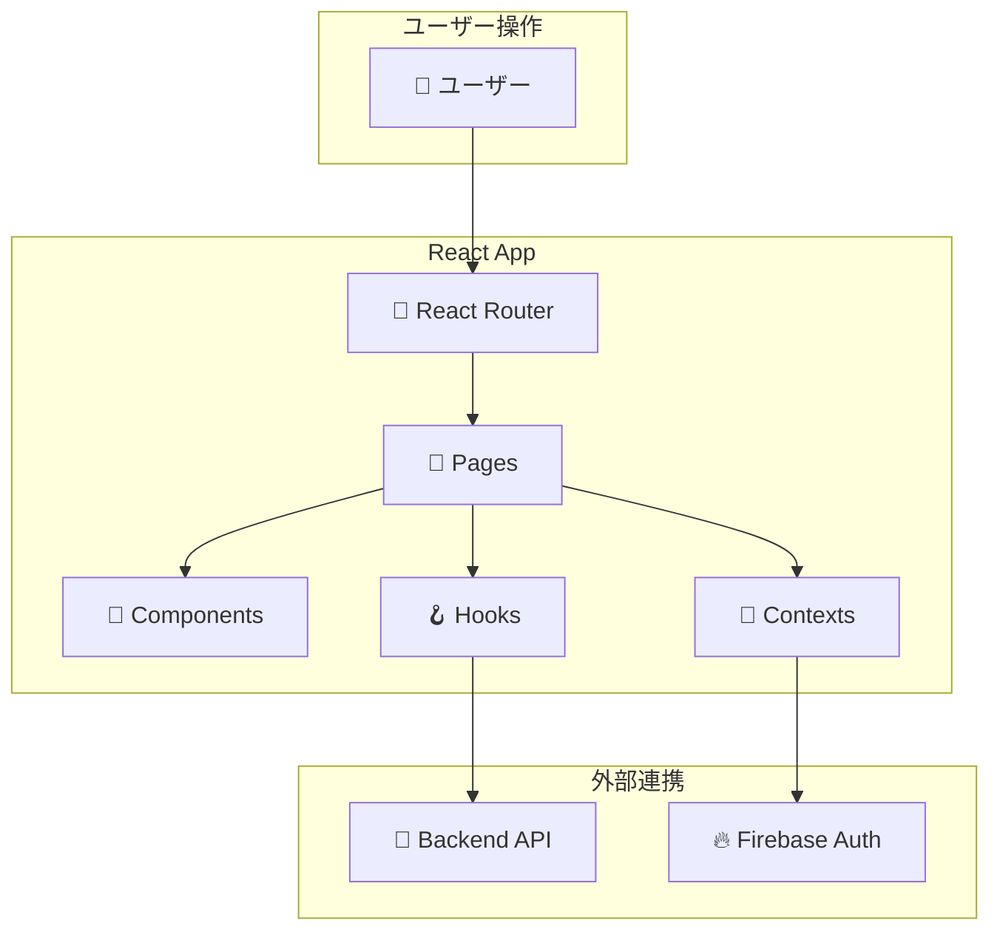

### 🔍 図の読み方（初心者向け）

上の図は「データがどう流れるか」を示しています：

| 番号 | 流れ | 意味 |
|------|------|------|
| ① | ユーザー → Router | URLにアクセスすると、React Routerが「どのページを表示するか」を決める |
| ② | Router → Pages | 例：`/gacha` にアクセス → `gacha_page.js` を表示 |
| ③ | Pages → Components | ページは再利用可能な部品（NavBar、チャットウィジェットなど）を組み合わせて作る |
| ④ | Pages → Contexts | 「今ログインしているユーザーは誰か」などのグローバル情報を取得 |
| ⑤ | Pages → Hooks | カスタムフック（`useLLMAgent`など）を使ってAPIと通信 |
| ⑥ | Contexts → Firebase | ログイン状態はFirebase Authで管理 |
| ⑦ | Hooks → API | 商品データ、チャット履歴などはバックエンドAPIから取得 |

**要するに：**
- **ユーザーがURLを開く** → **ページが表示される** → **必要なデータをAPIから取得**

---

## 🛠 技術スタック

| カテゴリ | 技術 | 用途 |
|---------|------|------|
| **UIライブラリ** | React 18 | コンポーネントベースUI |
| **UIフレームワーク** | Material-UI (MUI) | デザインシステム |
| **ルーティング** | React Router v6 | ページ遷移 |
| **HTTP通信** | Axios | APIリクエスト |
| **認証** | Firebase Auth | ログイン・ユーザー管理 |
| **状態管理** | React Context | グローバル状態 |

---

## 📂 ディレクトリ構成

```plaintext
hackathon-frontend/src/
├── App.js                         # 🔀 ルーティング定義
├── index.js                       # 🚀 エントリーポイント
│
├── api/
│   └── axios.js                   # 📡 Axiosインスタンス設定
│
├── config.js                      # ⚙️ 定数・色設定
├── firebase_config.js             # 🔥 Firebase初期化
│
├── contexts/                      # 🔄 状態管理
│   └── auth_context.js            # ログインユーザー管理
│
├── hooks/                         # 🪝 カスタムフック
│   └── useLLMAgent.js             # AI連携フック
│
├── pages/                         # 📄 ページコンポーネント (13)
│   ├── homepage.js                # トップページ
│   ├── item_detail_page.js        # 商品詳細
│   ├── item_create_page.js        # 出品フォーム
│   ├── buy_page.js                # 購入確認（クーポン適用可）
│   ├── my_page.js                 # マイページ
│   ├── mission_page.js            # ミッション＆クーポン
│   ├── seller_page.js             # 出品者:発送管理
│   ├── buyer_page.js              # 購入者:配送状況
│   ├── gacha_page.js              # ガチャ（クーポン適用可）
│   ├── persona_selection_page.js  # キャラ選択
│   ├── login_page.js              # ログイン
│   ├── register_page.js           # 新規登録
│   └── SearchResults.js           # 検索結果
│
├── components/                    # 🧩 再利用コンポーネント
│   ├── AIChatWidget.js            # AIチャット本体
│   ├── AIChatWidgetFloating.js    # フローティングチャット
│   ├── MissionBanner.js           # ミッションバナー（ホーム表示）
│   ├── CouponSelector.js          # クーポン選択UI
│   ├── CharacterDetailModal.js    # キャラ詳細ポップアップ
│   ├── NavBar.js                  # ナビゲーション
│   ├── HomepageComponents.js      # ホーム用部品
│   ├── HeaderShipmentPanel.js     # 配送状況パネル
│   ├── ProgressSteps.js           # 進捗ステップ
│   └── recommend_page.js          # おすすめ表示ポップアップ
│
└── utils/                         # 🔧 共通ユーティリティ
    └── missionUtils.js            # ミッション関連定数・関数
```

---

## 📄 ページ一覧

### サイトマップ

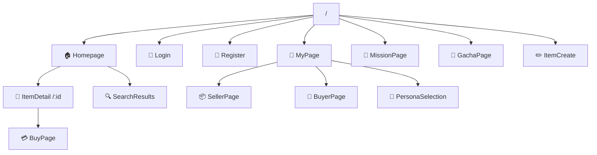

---

### 各ページ詳細

#### 1. 🏠 Homepage (`/`)
トップページ。商品一覧とカテゴリ切り替え、おすすめ表示。

| 機能 | 説明 |
|------|------|
| カテゴリタブ | レディース、メンズ、キッズなど |
| おすすめタブ | AIが選んだ商品（吹き出し付き） |
| 商品グリッド | クリックで詳細へ |

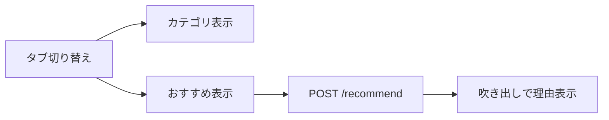

---

#### 2. 👕 ItemDetailPage (`/items/:id`)
商品詳細ページ。画像、価格、説明、いいね、コメント、購入ボタン。

| 機能 | API |
|------|-----|
| 商品情報取得 | `GET /items/{id}` |
| いいね | `POST /items/{id}/like` |
| コメント投稿 | `POST /items/{id}/comments` |
| 購入へ | → BuyPageへ遷移 |

---

#### 3. 💳 BuyPage (`/buy/:id`)
購入確認ページ。配送先入力、決済（簡易）。

| 機能 | API |
|------|-----|
| 購入実行 | `POST /items/{id}/buy` |

---

#### 4. 👤 MyPage (`/mypage`)
ユーザーのダッシュボード。

| タブ | 内容 | API |
|------|------|-----|
| 出品した商品 | 自分が出品 | `GET /users/me/items` |
| 購入した商品 | 購入履歴 | `GET /users/me/transactions` |
| いいね一覧 | いいねした商品 | `GET /users/me/likes` |
| コメント履歴 | コメントした商品 | `GET /users/me/comments` |

---

#### 5. 📦 SellerPage (`/seller`)
出品者向け発送管理。

| 機能 | API |
|------|-----|
| 発送待ち一覧 | `GET /transactions?role=seller&status=pending_shipment` |
| 発送ボタン | `POST /transactions/{id}/ship` |

---

#### 6. 🚚 BuyerPage (`/buyer`)
購入者向け配送状況確認。

| 機能 | API |
|------|-----|
| 配送中一覧 | `GET /transactions?role=buyer&status=in_transit` |
| 受取確認 | `POST /transactions/{id}/complete` |

---

#### 7. 🎰 GachaPage (`/gacha`)
キャラクターガチャ。

| 機能 | API |
|------|-----|
| ガチャを引く | `POST /gacha/draw` |

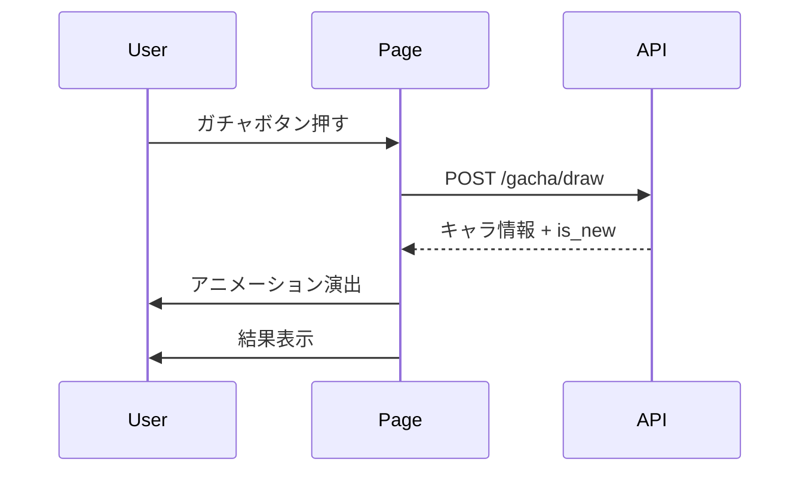

---

#### 8. 👥 PersonaSelectionPage (`/persona-selection`)
所持キャラ一覧から装備変更。

| 機能 | API |
|------|-----|
| 全キャラ一覧 | `GET /users/personas` |
| 所持キャラ | `GET /users/me/personas` |
| 装備変更 | `PUT /users/me/persona` |

**フロー:**
1. キャラをクリック → 詳細ポップアップ表示
2. 「パートナーにする」ボタン → API呼び出し → 装備変更

---

#### 9. 🔐 LoginPage / RegisterPage
Firebase Authを使ったログイン・新規登録。

---

#### 10. 🔍 SearchResults (`/search`)
テキスト検索結果表示。

| 機能 | API |
|------|-----|
| 検索 | `GET /search/items?query=xxx` |

---

## 🧩 コンポーネント一覧

### 1. 🤖 AIChatWidgetFloating（フローティングチャット）
画面上に自由に配置可能なAIチャットUI。ドラッグ＆リサイズ対応。

**機能:**
| 機能 | 説明 |
|------|------|
| ドラッグ移動 | キャラ画像エリアをドラッグして自由に配置 |
| リサイズ | 右・下・右下角をドラッグしてサイズ変更 |
| 閉じる/開く | 閉じるとキャラアバターボタン（右下）になる |

```
閉じた状態:              開いた状態:
         ┌────┐          ┌──────────────┐
         │ 🧙 │          │⋮           ✕│
         └────┘          │    🧙       │
                         ├──────────────┤
                         │ チャット履歴 │
                         └──────────────┘
```

---

### 2. 🎭 CharacterDetailModal
キャラクター詳細をポップアップ表示。

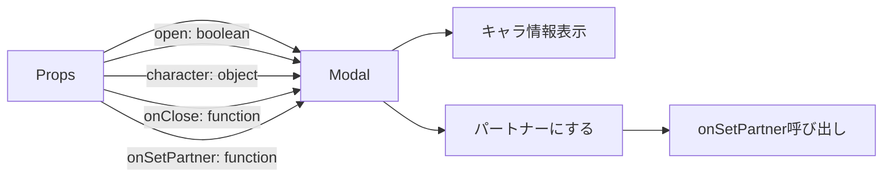

**表示内容:**
- 名前、レアリティ（星）
- MBTI
- Origin（出自）
- Description（説明）
- Tragedy（悲劇）
- Obsession（執着）
- Skill（スキル名・効果）

---

### 3. 📊 ProgressSteps
取引ステータスを3ステップで可視化。

```
[発送待ち] ─○─ [配送中] ─○─ [完了]
```

**Props:**
- `status`: `"pending_shipment"` | `"in_transit"` | `"completed"`

---

### 4. 🧭 NavBar
画面上部のナビゲーション。

| ボタン | 遷移先 |
|--------|--------|
| ホーム | `/` |
| 出品 | `/create` |
| マイページ | `/mypage` |
| ガチャ | `/gacha` |

---

## 🔄 状態管理

### AuthContext (auth_context.js)

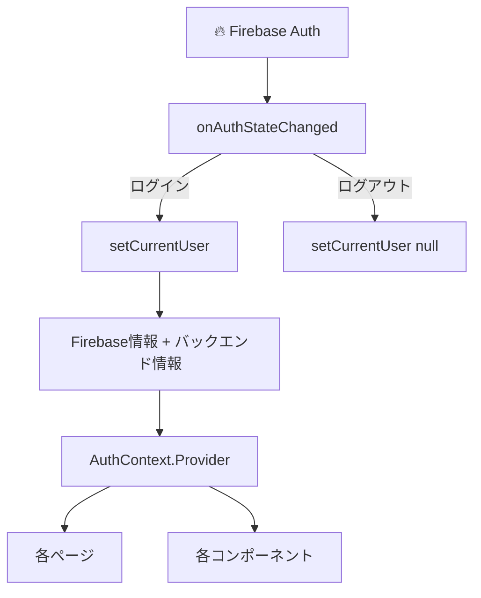

**提供する値:**
| 名前 | 型 | 説明 |
|------|------|------|
| `currentUser` | object | ログイン中ユーザー情報 |
| `signup()` | function | 新規登録 |
| `login()` | function | ログイン |
| `logout()` | function | ログアウト |
| `refreshUser()` | function | ユーザー情報再取得 |

**使い方:**
```jsx
import { useAuth } from '../contexts/auth_context';

const MyComponent = () => {
  const { currentUser, logout } = useAuth();
  
  return <div>ようこそ、{currentUser?.email}さん</div>;
};
```

---

### PageContext (AIChatWidget.js内)

ページ遷移時にAIにコンテキストを伝えるための仕組み。

```jsx
const { setPageContext } = usePageContext();

// ページ読み込み時
useEffect(() => {
  setPageContext({
    page_type: 'item_detail',
    item_id: itemId,
    item_name: item.name
  });
}, [item]);
```

---

## � チャット履歴の仕組み

AIチャットのメッセージはデータベースに保存され、セッションを跨いで履歴が残ります。

### データの流れ

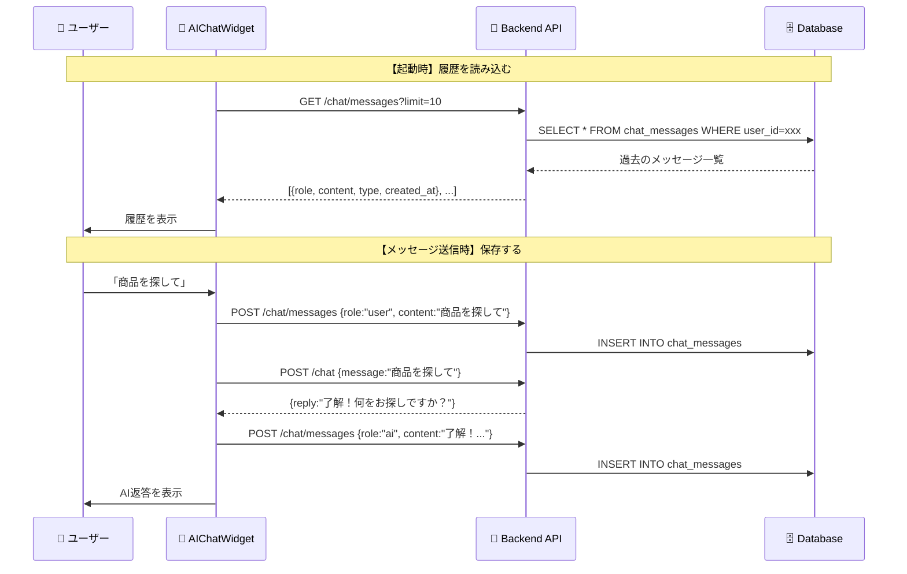

### 送受信されるデータ

#### 履歴取得（GET /chat/messages）

**リクエスト：**
```
GET /api/v1/chat/messages?limit=10
ヘッダー: X-Firebase-Uid: <ユーザーID>
```

**レスポンス：**
```json
[
  {
    "id": 123,
    "role": "user",          // "user" または "ai"
    "content": "こんにちは！",
    "type": "chat",          // "chat" または "guidance"
    "page_path": "/",        // どのページで発言されたか
    "created_at": "2024-01-01T12:00:00"
  },
  ...
]
```

#### メッセージ保存（POST /chat/messages）

**リクエスト：**
```json
{
  "role": "user",
  "content": "この商品を探して",
  "type": "chat",
  "page_path": "/items/123"
}
```

### フロントエンドの実装箇所

| ファイル | 関数 | 役割 |
|----------|------|------|
| `AIChatWidget.js` | `loadHistory()` | 起動時に履歴を取得 |
| `AIChatWidget.js` | `saveMessageToAPI()` | メッセージをDBに保存 |
| `AIChatWidget.js` | `handleSend()` | ユーザー入力を処理 |

---

## 🛠️ Function Calling（AIによるアプリ操作）

**Function Calling**とは、AIが「ユーザーの意図」を理解して、**アプリを自動で操作する機能**です。

### 例：ユーザーが「ガチャ引いて」と言った場合

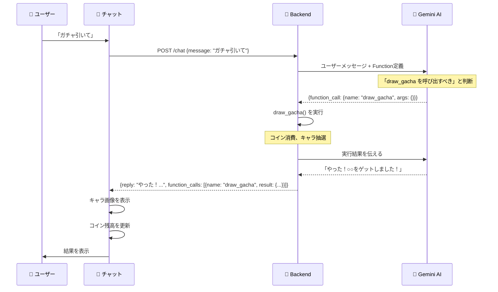

### 🔑 ポイント

1. **AIが「どの機能を使うか」を判断する**：ユーザーは自然言語で話すだけ
2. **バックエンドで実際の処理を実行**：ガチャ抽選、商品検索など
3. **結果をフロントエンドに返す**：UIの更新（画像表示、ページ遷移など）

### 定義されているFunction一覧

| Function名 | 説明 | AIが呼ぶタイミング |
|------------|------|-------------------|
| `search_items` | 商品を検索 | 「〜を探して」「〜ある？」 |
| `get_item_details` | 商品詳細を取得 | 「この商品について教えて」 |
| `navigate_to_page` | ページ遷移 | 「マイページに行きたい」 |
| `like_item` | いいねをつける | 「これいいね」 |
| `draw_gacha` | ガチャを引く | 「ガチャ引いて」「くじ引いて」 |
| `get_recommendations` | おすすめ商品を取得 | 「おすすめある？」 |
| `check_balance` | コイン残高確認 | 「残高いくら？」 |
| `suggest_price` | 価格を提案 | 「いくらで売れる？」 |
| `generate_description` | 商品説明を生成 | 「説明文を書いて」 |
| `start_listing` | 出品フォームへ | 「これを出品して」 |

### 送受信されるデータ（詳細）

#### チャットリクエスト（POST /chat）

**リクエスト：**
```json
{
  "message": "ガチャ引いて！",
  "page_context": {
    "page": "gacha",
    "user_coins": 500,
    "gacha_cost": 100
  }
}
```

**レスポンス（Function Callあり）：**
```json
{
  "reply": "やった！ドット絵の青年をゲットしました！100コインを使いました。",
  "persona": {
    "name": "強気なギャル",
    "avatar_url": "/avatars/model2.png"
  },
  "function_calls": [
    {
      "name": "draw_gacha",
      "result": {
        "action": "draw_gacha",
        "result": {
          "persona_id": 1,
          "name": "ドット絵の青年",
          "rarity": 1,
          "avatar_url": "/avatars/model1.png",
          "is_new": true
        },
        "cost_spent": 100,
        "remaining_coins": 400
      }
    }
  ]
}
```

### フロントエンドでの処理

`AIChatWidget.js` の `handleFunctionCalls()` で結果を処理します：

```javascript
// function_callsの各結果をループ
for (const fc of functionCalls) {
  switch (fc.result?.action) {
    case 'navigate':
      // ページ遷移
      window.location.href = fc.result.path;
      break;
      
    case 'draw_gacha':
      // ガチャ結果をチャットに表示
      setMessages(prev => [...prev, {
        role: 'ai',
        content: `🎉 ${result.name} をゲット！`,
        gachaData: result  // 画像表示用
      }]);
      refreshUser();  // コイン残高を更新
      break;
      
    case 'search_items':
      // 検索結果ページへ遷移
      window.location.href = `/search?q=${result.query}`;
      break;
      
    // ... 他のアクション
  }
}
```

### バックエンドの実装箇所

| ファイル | 役割 |
|----------|------|
| `function_tools.py` | Function定義と実行ロジック |
| `llm_service.py` | LLMとの通信、Function Callの処理ループ |
| `chat.py` | APIエンドポイント |

---

## 📚 Deep Dive: `start_listing`の完全フロー解説

**「出品して」と言った時、裏で何が起きているか**を、初心者向けに完全解説します。

### 🎬 全体の流れ（30秒でわかる版）

```
ユーザー: 「このバッグを3000円で出品して」
    ↓
フロントエンド: メッセージをAPIに送信
    ↓
バックエンド: Gemini AIにメッセージ + Function定義を渡す
    ↓
Gemini AI: 「start_listingを呼ぶべき」と判断
    ↓
バックエンド: start_listingを実行し、結果をGeminiに返す
    ↓
Gemini AI: 「出品ページに移動するね！」と返答
    ↓
フロントエンド: /items/create?name=バッグ&price=3000 に遷移
```

---

### Step 1️⃣ ユーザーがメッセージを送信

**ファイル**: `AIChatWidget.js`

ユーザーが「このバッグを3000円で出品して」と入力すると、以下のコードが動きます：

```javascript
// handleSend() 関数内
const res = await apiClient.post('/chat', {
  message: "このバッグを3000円で出品して",
  page_context: {
    page: "homepage",  // 現在ホームページにいる
    // ... その他のページ情報
  }
});
```

**送信されるデータ**:
```json
{
  "message": "このバッグを3000円で出品して",
  "page_context": {
    "page": "homepage"
  }
}
```

---

### Step 2️⃣ バックエンドがリクエストを受信

**ファイル**: `chat.py`

```python
@router.post("", response_model=ChatResponse)
def chat_with_agent(chat_in: ChatRequest, ...):
    # ページコンテキストがあればテキスト化
    if chat_in.page_context:
        context_text = build_context_text(page_context)
    
    # メッセージにコンテキストを付加
    enhanced_message = f"""
[現在のページ状況]
{context_text}

[ユーザーの質問]
{chat_in.message}
"""
    
    # LLMサービスを呼び出す
    result = service.chat_with_persona(
        current_user.firebase_uid,
        current_chat=enhanced_message,
    )
    return result
```

**LLMに渡される実際のメッセージ**:
```
[現在のページ状況]
ホームページにいます。

[ユーザーの質問]
このバッグを3000円で出品して
```

---

### Step 3️⃣ LLMサービスがGemini AIを呼び出す

**ファイル**: `llm_service.py`

ここが最も重要な部分！Gemini AIに渡す情報をすべて準備します。

#### 3-1. システムプロンプトの構築

```python
# ペルソナのsystem_promptを取得
system_instruction = current_persona.system_prompt

# 追加のルールを付加
system_instruction += """
【最優先の出力ルール - 必ず守ること】
1. まず心の中で考えてから返答を作成してください
2. ただし「(心中)」の内容はユーザーに見せないでください
3. 出力するのは「発言」の内容のみ
4. 返答は3〜4行で簡潔に
5. キャラクターの口調で話してください
"""
```

**完成したシステムプロンプト例**（ペルソナが「強気なギャル」の場合）:
```
# Character Profile
- **Origin**: 2000年代中盤のデコメ職人
- **MBTI**: ESFP (エンターテイナー)
- **Speech**: 一人称は「ウチ」。語尾は「〜だし」「〜じゃね？」

【最優先の出力ルール】
1. まず心の中で考えてから返答を作成してください
...
```

#### 3-2. Function定義をGeminiに渡す

```python
# function_tools.py で定義されているFunctions
TOOLS = types.Tool(function_declarations=[
    # ... 10個のFunction定義
    types.FunctionDeclaration(
        name="start_listing",
        description="出品フォームに遷移して情報を自動入力する。...",
        parameters=types.Schema(
            type=types.Type.OBJECT,
            properties={
                "name": types.Schema(type=types.Type.STRING, description="商品名"),
                "price": types.Schema(type=types.Type.INTEGER, description="価格"),
                "category": types.Schema(type=types.Type.STRING, description="カテゴリ"),
                "description": types.Schema(type=types.Type.STRING, description="商品説明"),
            },
            required=["name"],
        ),
    ),
])

# Gemini API設定
config = types.GenerateContentConfig(
    system_instruction=system_instruction,
    temperature=0.7,
    tools=[TOOLS],  # ← これでGeminiがFunction Callingできる！
)
```

**Geminiに渡される情報まとめ**:
| 項目 | 内容 |
|------|------|
| システムプロンプト | ペルソナの性格 + 出力ルール |
| 会話履歴 | 過去のユーザーとAIのやり取り |
| 今回のメッセージ | 「このバッグを3000円で出品して」 |
| Function定義 | 10個のFunction（start_listing含む） |

---

### Step 4️⃣ Gemini AIが「start_listingを呼ぶ」と判断

Geminiは上記の情報を見て、**テキスト返答ではなく「Function Call」を返します**。

**Geminiからのレスポンス（内部表現）**:
```json
{
  "candidates": [{
    "content": {
      "parts": [{
        "function_call": {
          "name": "start_listing",
          "args": {
            "name": "バッグ",
            "price": 3000
          }
        }
      }]
    }
  }]
}
```

**なぜstart_listingが選ばれた？**
- Geminiはfunction定義の`description`を読む
- 「出品フォームに遷移して情報を自動入力する。ユーザーが『出品して』『売りたい』と言った時に使う」
- ユーザーが「出品して」と言っているので、これに該当！

---

### Step 5️⃣ Function実行

**ファイル**: `llm_service.py` → `function_tools.py`

```python
# llm_service.py
if has_function_call:
    for part in parts:
        if hasattr(part, 'function_call'):
            fc = part.function_call
            func_name = fc.name  # "start_listing"
            func_args = dict(fc.args)  # {"name": "バッグ", "price": 3000}
            
            # FunctionExecutorで実行
            executor = FunctionExecutor(self.db, user_id)
            result = executor.execute(func_name, func_args)

# function_tools.py
def _exec_start_listing(self, name: str, price: int = None, ...):
    return {
        "action": "start_listing",
        "path": "/items/create",
        "prefill": {
            "name": name,      # "バッグ"
            "price": price,    # 3000
            "category": None,
            "description": None,
        },
    }
```

**Function実行結果**:
```json
{
  "action": "start_listing",
  "path": "/items/create",
  "prefill": {
    "name": "バッグ",
    "price": 3000,
    "category": null,
    "description": null
  }
}
```

---

### Step 6️⃣ 結果をGeminiに返して最終応答を生成

```python
# llm_service.py
# Function実行結果をGeminiに伝える
function_response = types.Content(
    role="function",
    parts=[types.Part.from_function_response(
        name="start_listing",
        response={"result": result}  # 上記のFunction実行結果
    )]
)
contents.append(function_response)

# もう一度Geminiに問い合わせ
response = self.client.models.generate_content(...)
```

**Geminiへの追加情報**:
```
「start_listingを実行した結果、path=/items/create、prefill={name:バッグ, price:3000}だったよ」
```

**Geminiの最終応答**:
```
「いいじゃん！バッグを3000円で出品するね！出品ページに移動するから、ちょっと待ってて！」
```

---

### Step 7️⃣ フロントエンドがレスポンスを受信

**ファイル**: `AIChatWidget.js`

```javascript
// APIレスポンス
const response = {
  "reply": "いいじゃん！バッグを3000円で出品するね！",
  "persona": { "name": "強気なギャル", "avatar_url": "/avatars/model2.png" },
  "function_calls": [{
    "name": "start_listing",
    "result": {
      "action": "start_listing",
      "path": "/items/create",
      "prefill": { "name": "バッグ", "price": 3000 }
    }
  }]
}

// handleFunctionCalls() で処理
for (const fc of response.function_calls) {
  switch (fc.result?.action) {
    case 'start_listing':
      // URLパラメータを構築
      const params = new URLSearchParams();
      params.set('name', fc.result.prefill.name);   // "バッグ"
      params.set('price', fc.result.prefill.price); // 3000
      
      // 出品ページに遷移
      window.location.href = `/items/create?name=バッグ&price=3000`;
      break;
  }
}
```

---

### Step 8️⃣ 出品ページがURLパラメータを読み取る

**ファイル**: `item_create_page.js`

```javascript
// URLからパラメータを取得
const searchParams = new URLSearchParams(window.location.search);
const prefillName = searchParams.get('name');   // "バッグ"
const prefillPrice = searchParams.get('price'); // "3000"

// フォームにプリフィル
const [name, setName] = useState(prefillName || '');
const [price, setPrice] = useState(prefillPrice || '');
```

**結果**:
- 出品フォームの「商品名」欄に「バッグ」が入力済み
- 「価格」欄に「3000」が入力済み

---

### 🎉 完了！

ユーザーは「出品して」と言っただけで、AIが商品名と価格を理解し、出品フォームに自動入力してくれました！

---

### 📌 まとめ：データの流れ

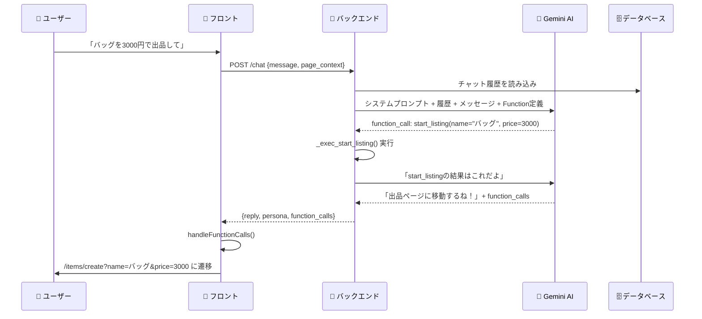

---

## �🔄 機能別 詳細解説

### 1. 商品一覧表示フロー

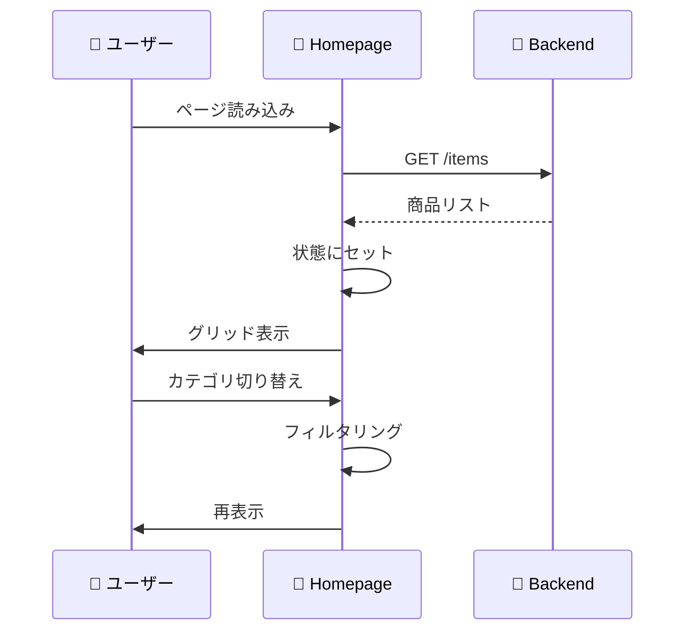

---

### 2. いいね機能

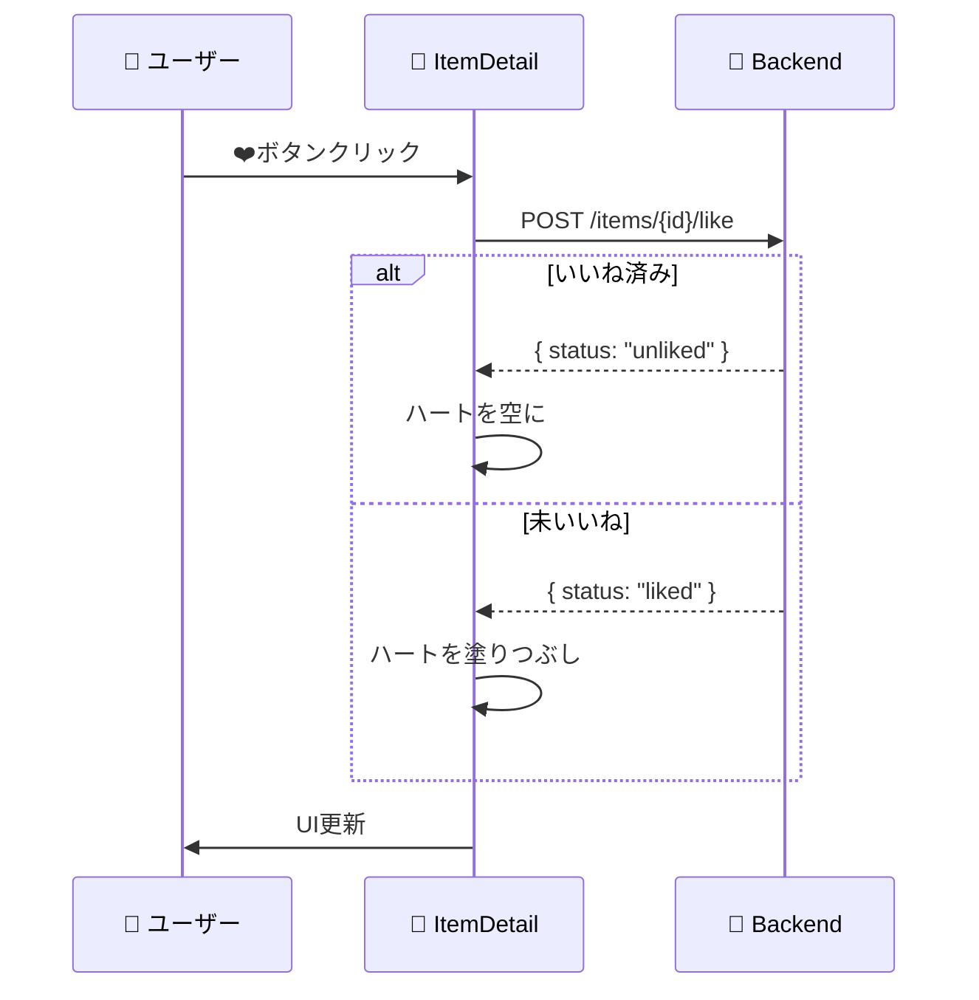

---

### 3. AIおすすめ表示

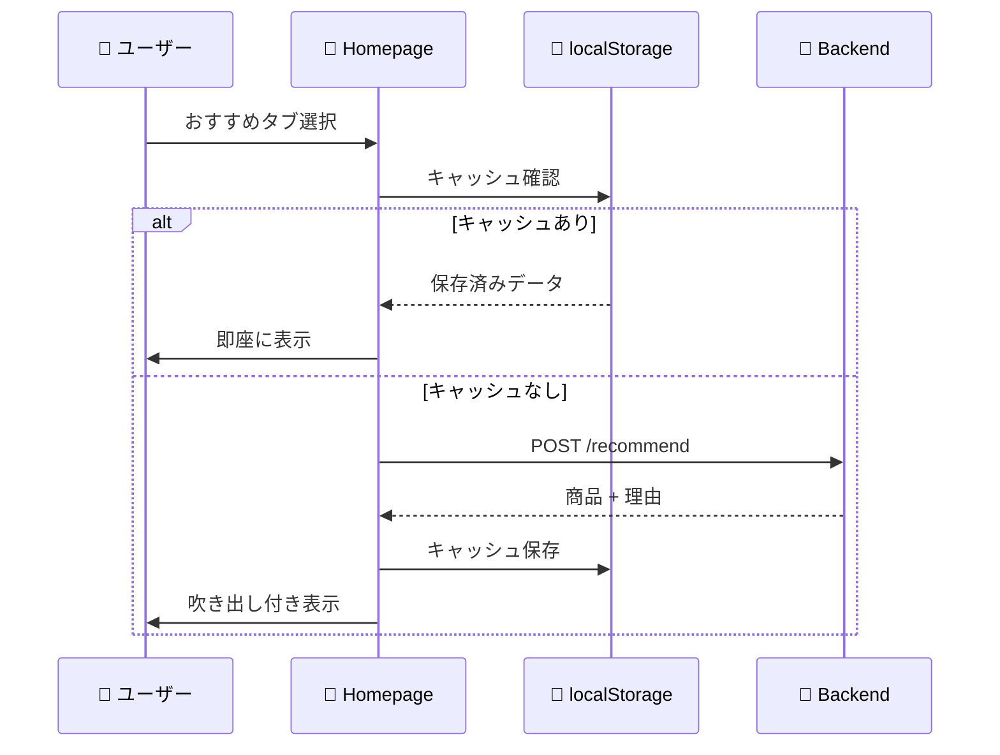

---

### 4. キャラ選択フロー

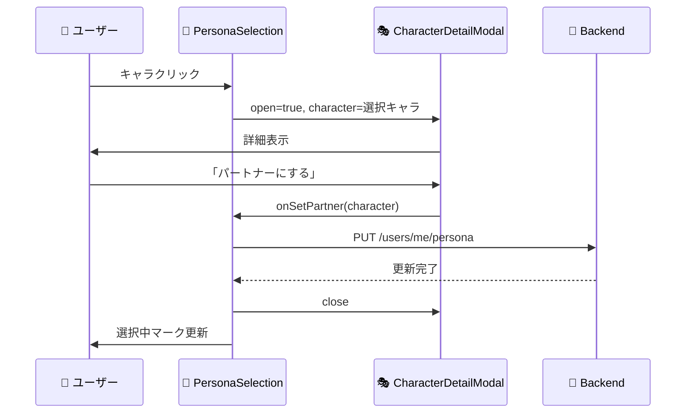

---

## 🚀 セットアップ手順

### 1. 依存関係インストール
```bash
npm install
```

### 2. 環境変数設定 (`.env`)
```ini
REACT_APP_API_URL=http://localhost:8080
REACT_APP_FIREBASE_API_KEY=your_api_key
REACT_APP_FIREBASE_AUTH_DOMAIN=your_project.firebaseapp.com
REACT_APP_FIREBASE_PROJECT_ID=your_project_id
```

### 3. 開発サーバー起動
```bash
npm start
```
→ `http://localhost:3000` でアクセス

### 4. 本番ビルド
```bash
npm run build
```
→ `build/` フォルダに成果物生成

---

## 📝 開発Tips

### 新ページ追加の流れ

1. **ページ作成**: `src/pages/NewPage.js`
2. **ルート追加**: `App.js` の `<Routes>` に追加
3. **ナビ追加**: `NavBar.js` にリンク追加

### 新コンポーネント追加の流れ

1. **ファイル作成**: `src/components/NewComponent.js`
2. **import**: 使用するページでインポート
3. **Props設計**: 必要なデータを親から渡す

### デバッグ

```javascript
// コンソールに状態を出力
console.log("現在のユーザー:", currentUser);

// Network確認
// ブラウザのDevTools → Network タブ
```

### よくあるエラー

| エラー | 原因 | 解決策 |
|--------|------|--------|
| CORS error | バックエンドが起動していない | バックエンドを起動 |
| 401 Unauthorized | ログインしていない | ログイン実行 |
| 404 Not Found | APIパスが間違い | エンドポイント確認 |

---

Happy Coding! 🚀