# 🎨 FleaMarketApp Frontend 完全ガイド

初心者でも「どこに何があるか」「どう動くか」を完全に理解できるドキュメントです。

---

## 📋 目次

1. [システム概要](#-システム概要)
2. [技術スタック](#-技術スタック)
3. [ディレクトリ構成](#-ディレクトリ構成)
4. [ページ一覧](#-ページ一覧)
5. [コンポーネント一覧](#-コンポーネント一覧)
6. [状態管理](#-状態管理)
7. [機能別 詳細解説](#-機能別-詳細解説)
8. [セットアップ手順](#-セットアップ手順)

---

## 🏗 システム概要

このフロントエンドは「AIキャラクターと一緒に買い物を楽しむフリマアプリ」のUIを担当します。

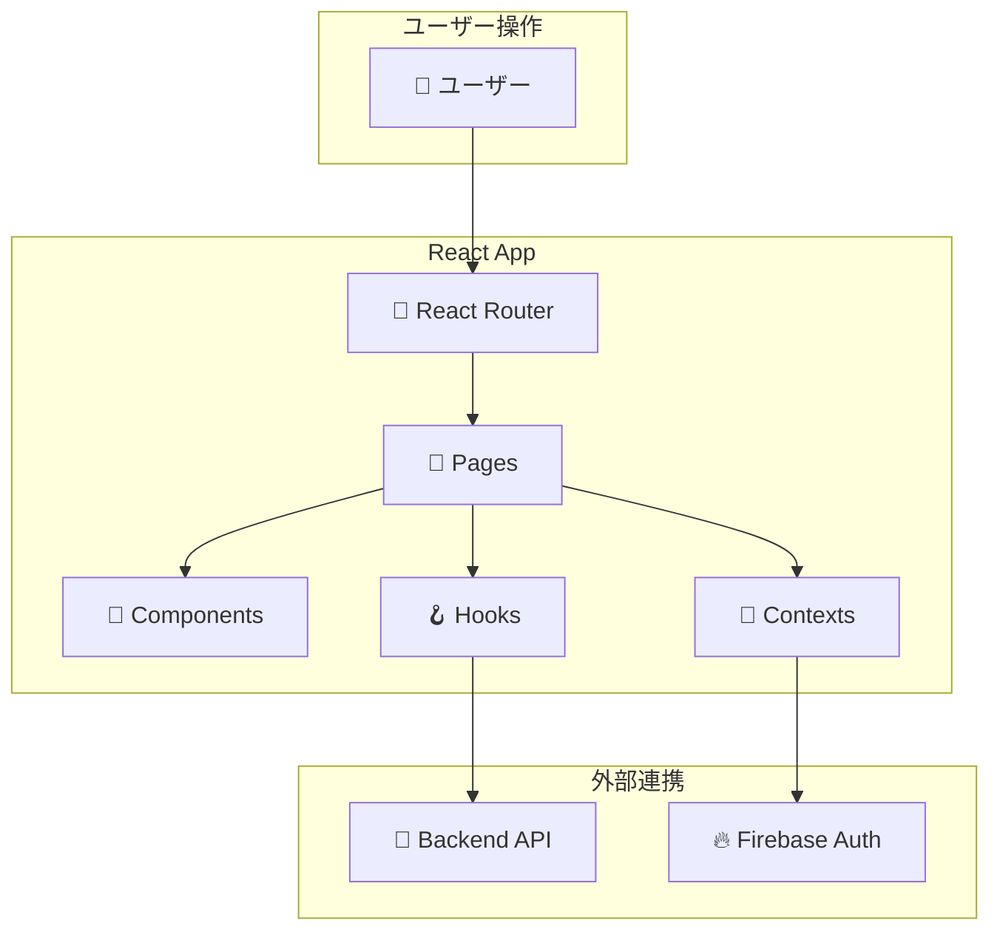

---

## 🛠 技術スタック

| カテゴリ | 技術 | 用途 |
|---------|------|------|
| **UIライブラリ** | React 18 | コンポーネントベースUI |
| **UIフレームワーク** | Material-UI (MUI) | デザインシステム |
| **ルーティング** | React Router v6 | ページ遷移 |
| **HTTP通信** | Axios | APIリクエスト |
| **認証** | Firebase Auth | ログイン・ユーザー管理 |
| **状態管理** | React Context | グローバル状態 |

---

## 📂 ディレクトリ構成

```plaintext
hackathon-frontend/src/
├── App.js                         # 🔀 ルーティング定義
├── index.js                       # 🚀 エントリーポイント
│
├── api/
│   └── axios.js                   # 📡 Axiosインスタンス設定
│
├── config.js                      # ⚙️ 定数・色設定
├── firebase_config.js             # 🔥 Firebase初期化
│
├── contexts/                      # 🔄 状態管理
│   └── auth_context.js            # ログインユーザー管理
│
├── hooks/                         # 🪝 カスタムフック
│   └── useLLMAgent.js             # AI連携フック
│
├── pages/                         # 📄 ページコンポーネント (12)
│   ├── homepage.js                # トップページ
│   ├── item_detail_page.js        # 商品詳細
│   ├── item_create_page.js        # 出品フォーム
│   ├── buy_page.js                # 購入確認
│   ├── my_page.js                 # マイページ
│   ├── seller_page.js             # 出品者:発送管理
│   ├── buyer_page.js              # 購入者:配送状況
│   ├── gacha_page.js              # ガチャ
│   ├── persona_selection_page.js  # キャラ選択
│   ├── login_page.js              # ログイン
│   ├── register_page.js           # 新規登録
│   └── SearchResults.js           # 検索結果
│
└── components/                    # 🧩 再利用コンポーネント (8)
    ├── AIChatWidget.js            # AIチャット
    ├── AIChatWidgetSlide.js       # チャットスライドUI
    ├── CharacterDetailModal.js    # キャラ詳細ポップアップ
    ├── NavBar.js                  # ナビゲーション
    ├── HomepageComponents.js      # ホーム用部品
    ├── HeaderShipmentPanel.js     # 配送状況パネル
    ├── ProgressSteps.js           # 進捗ステップ
    └── recommend_page.js          # おすすめ表示
```

---

## 📄 ページ一覧

### サイトマップ

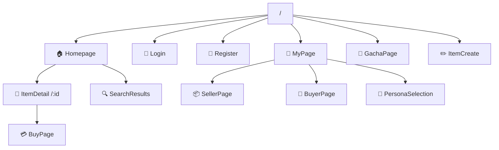

---

### 各ページ詳細

#### 1. 🏠 Homepage (`/`)
トップページ。商品一覧とカテゴリ切り替え、おすすめ表示。

| 機能 | 説明 |
|------|------|
| カテゴリタブ | レディース、メンズ、キッズなど |
| おすすめタブ | AIが選んだ商品（吹き出し付き） |
| 商品グリッド | クリックで詳細へ |

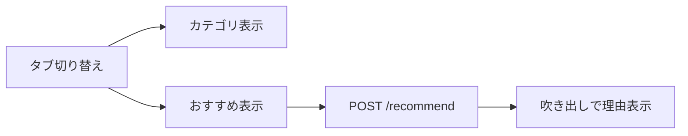

---

#### 2. 👕 ItemDetailPage (`/items/:id`)
商品詳細ページ。画像、価格、説明、いいね、コメント、購入ボタン。

| 機能 | API |
|------|-----|
| 商品情報取得 | `GET /items/{id}` |
| いいね | `POST /items/{id}/like` |
| コメント投稿 | `POST /items/{id}/comments` |
| 購入へ | → BuyPageへ遷移 |

---

#### 3. 💳 BuyPage (`/buy/:id`)
購入確認ページ。配送先入力、決済（簡易）。

| 機能 | API |
|------|-----|
| 購入実行 | `POST /items/{id}/buy` |

---

#### 4. 👤 MyPage (`/mypage`)
ユーザーのダッシュボード。

| タブ | 内容 | API |
|------|------|-----|
| 出品した商品 | 自分が出品 | `GET /users/me/items` |
| 購入した商品 | 購入履歴 | `GET /users/me/transactions` |
| いいね一覧 | いいねした商品 | `GET /users/me/likes` |
| コメント履歴 | コメントした商品 | `GET /users/me/comments` |

---

#### 5. 📦 SellerPage (`/seller`)
出品者向け発送管理。

| 機能 | API |
|------|-----|
| 発送待ち一覧 | `GET /transactions?role=seller&status=pending_shipment` |
| 発送ボタン | `POST /transactions/{id}/ship` |

---

#### 6. 🚚 BuyerPage (`/buyer`)
購入者向け配送状況確認。

| 機能 | API |
|------|-----|
| 配送中一覧 | `GET /transactions?role=buyer&status=in_transit` |
| 受取確認 | `POST /transactions/{id}/complete` |

---

#### 7. 🎰 GachaPage (`/gacha`)
キャラクターガチャ。

| 機能 | API |
|------|-----|
| ガチャを引く | `POST /gacha/draw` |

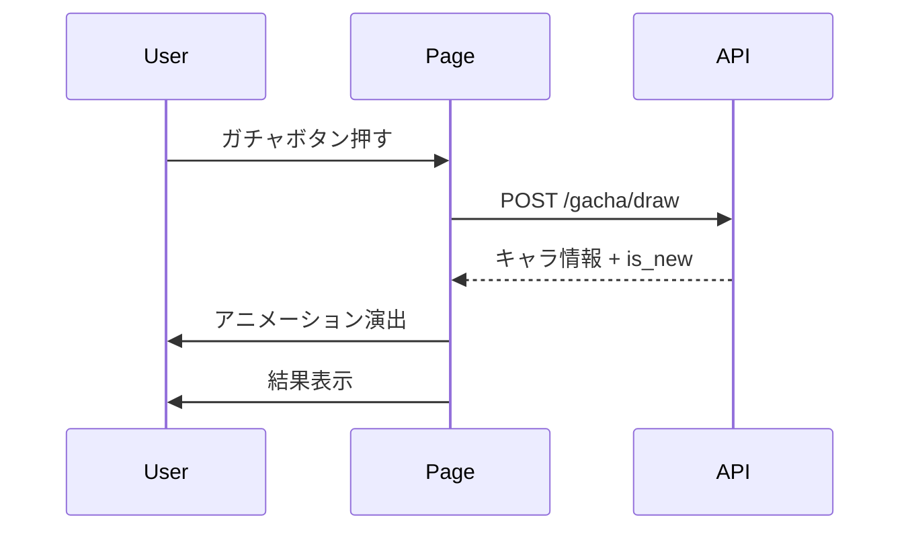

---

#### 8. 👥 PersonaSelectionPage (`/persona-selection`)
所持キャラ一覧から装備変更。

| 機能 | API |
|------|-----|
| 全キャラ一覧 | `GET /users/personas` |
| 所持キャラ | `GET /users/me/personas` |
| 装備変更 | `PUT /users/me/persona` |

**フロー:**
1. キャラをクリック → 詳細ポップアップ表示
2. 「パートナーにする」ボタン → API呼び出し → 装備変更

---

#### 9. 🔐 LoginPage / RegisterPage
Firebase Authを使ったログイン・新規登録。

---

#### 10. 🔍 SearchResults (`/search`)
テキスト検索結果表示。

| 機能 | API |
|------|-----|
| 検索 | `GET /search/items?query=xxx` |

---

## 🧩 コンポーネント一覧

### 1. 🤖 AIChatWidget
画面右下に常駐するAIチャットUI。

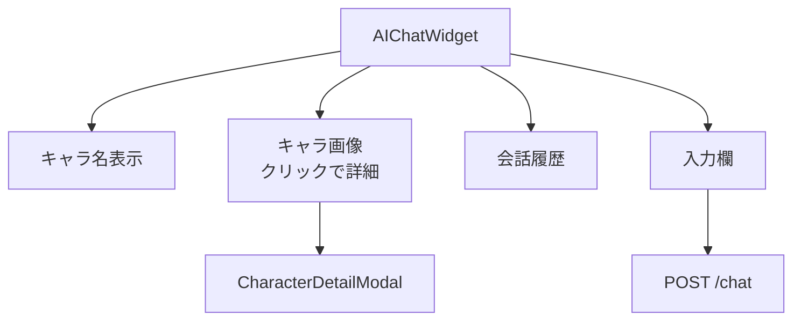

**Props:**
- なし（内部でAuthContext使用）

---

### 2. 🎭 CharacterDetailModal
キャラクター詳細をポップアップ表示。

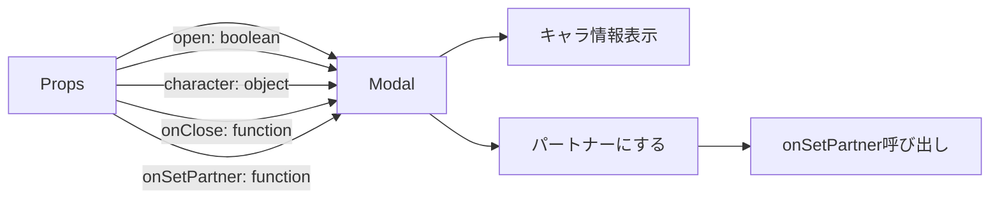

**表示内容:**
- 名前、レアリティ（星）
- MBTI
- Origin（出自）
- Description（説明）
- Tragedy（悲劇）
- Obsession（執着）
- Skill（スキル名・効果）

---

### 3. 📊 ProgressSteps
取引ステータスを3ステップで可視化。

```
[発送待ち] ─○─ [配送中] ─○─ [完了]
```

**Props:**
- `status`: `"pending_shipment"` | `"in_transit"` | `"completed"`

---

### 4. 🧭 NavBar
画面上部のナビゲーション。

| ボタン | 遷移先 |
|--------|--------|
| ホーム | `/` |
| 出品 | `/create` |
| マイページ | `/mypage` |
| ガチャ | `/gacha` |

---

## 🔄 状態管理

### AuthContext (auth_context.js)

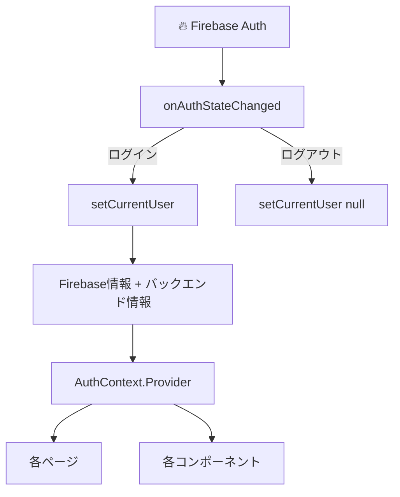

**提供する値:**
| 名前 | 型 | 説明 |
|------|------|------|
| `currentUser` | object | ログイン中ユーザー情報 |
| `signup()` | function | 新規登録 |
| `login()` | function | ログイン |
| `logout()` | function | ログアウト |
| `refreshUser()` | function | ユーザー情報再取得 |

**使い方:**
```jsx
import { useAuth } from '../contexts/auth_context';

const MyComponent = () => {
  const { currentUser, logout } = useAuth();
  
  return <div>ようこそ、{currentUser?.email}さん</div>;
};
```

---

### PageContext (AIChatWidget.js内)

ページ遷移時にAIにコンテキストを伝えるための仕組み。

```jsx
const { setPageContext } = usePageContext();

// ページ読み込み時
useEffect(() => {
  setPageContext({
    page_type: 'item_detail',
    item_id: itemId,
    item_name: item.name
  });
}, [item]);
```

---

## 🔄 機能別 詳細解説

### 1. 商品一覧表示フロー

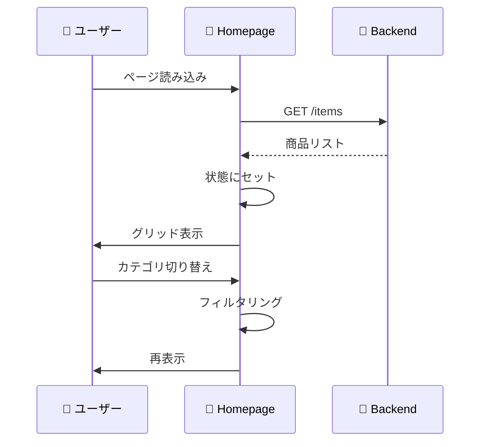

---

### 2. いいね機能

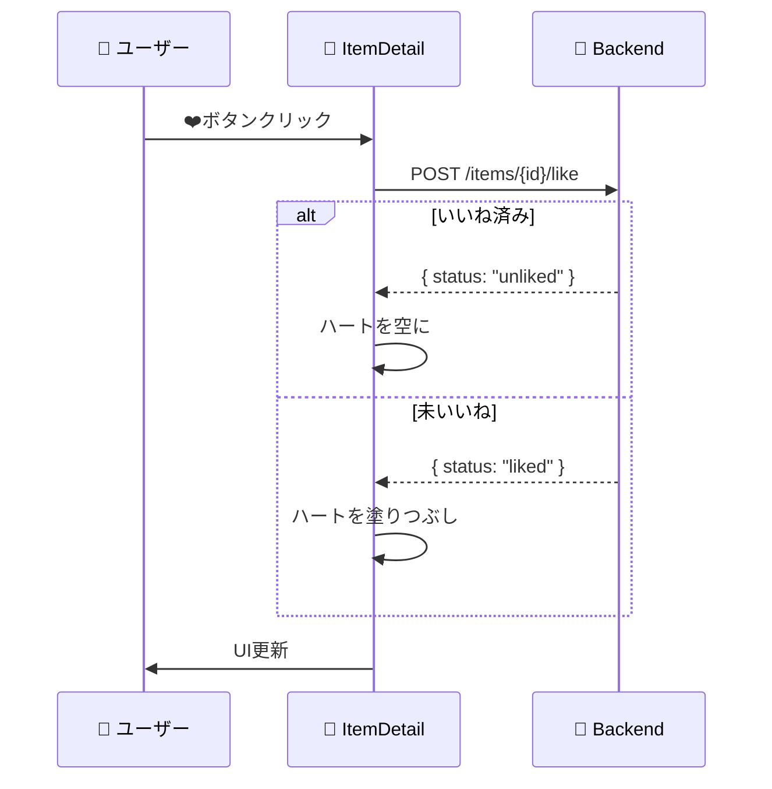

---

### 3. AIおすすめ表示

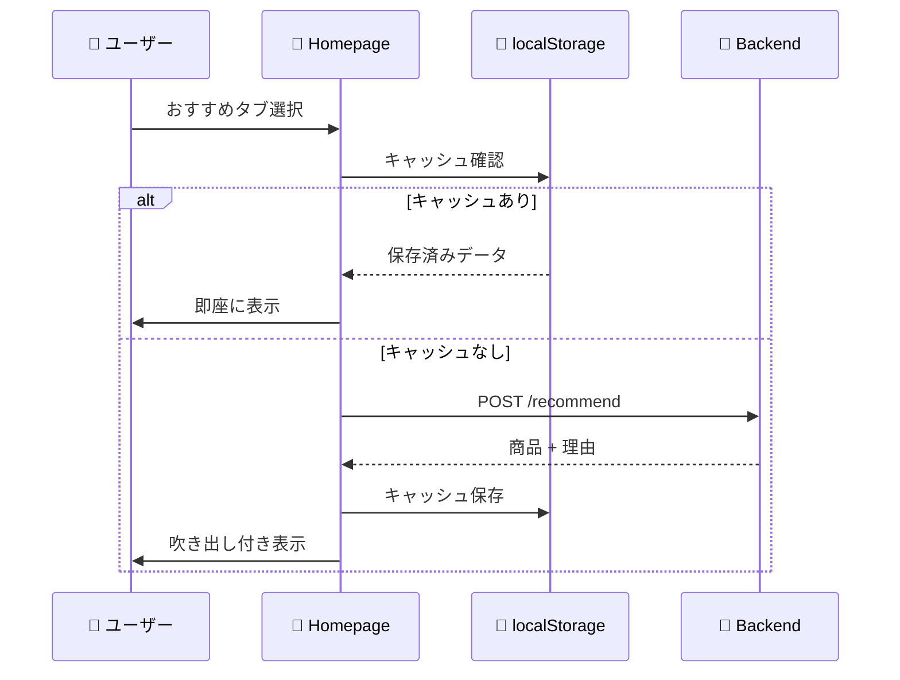

---

### 4. キャラ選択フロー

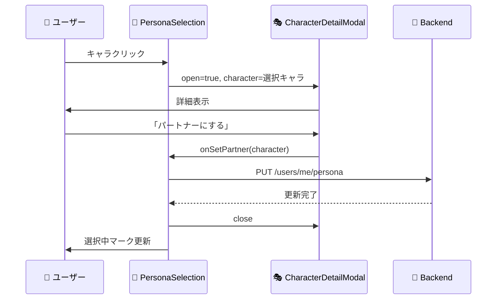

---

## 🚀 セットアップ手順

### 1. 依存関係インストール
```bash
npm install
```

### 2. 環境変数設定 (`.env`)
```ini
REACT_APP_API_URL=http://localhost:8080
REACT_APP_FIREBASE_API_KEY=your_api_key
REACT_APP_FIREBASE_AUTH_DOMAIN=your_project.firebaseapp.com
REACT_APP_FIREBASE_PROJECT_ID=your_project_id
```

### 3. 開発サーバー起動
```bash
npm start
```
→ `http://localhost:3000` でアクセス

### 4. 本番ビルド
```bash
npm run build
```
→ `build/` フォルダに成果物生成

---

## 📝 開発Tips

### 新ページ追加の流れ

1. **ページ作成**: `src/pages/NewPage.js`
2. **ルート追加**: `App.js` の `<Routes>` に追加
3. **ナビ追加**: `NavBar.js` にリンク追加

### 新コンポーネント追加の流れ

1. **ファイル作成**: `src/components/NewComponent.js`
2. **import**: 使用するページでインポート
3. **Props設計**: 必要なデータを親から渡す

### デバッグ

```javascript
// コンソールに状態を出力
console.log("現在のユーザー:", currentUser);

// Network確認
// ブラウザのDevTools → Network タブ
```

### よくあるエラー

| エラー | 原因 | 解決策 |
|--------|------|--------|
| CORS error | バックエンドが起動していない | バックエンドを起動 |
| 401 Unauthorized | ログインしていない | ログイン実行 |
| 404 Not Found | APIパスが間違い | エンドポイント確認 |

---

Happy Coding! 🚀