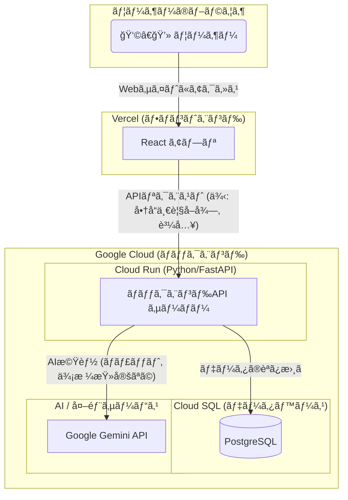
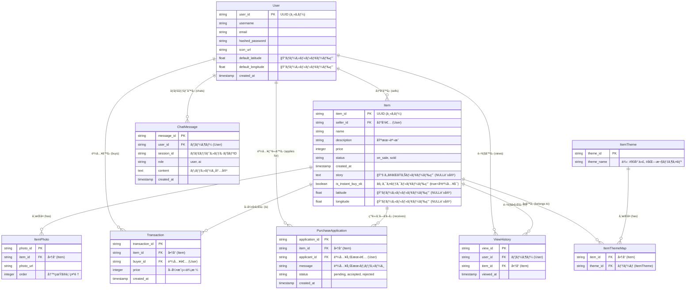

# FleaMarketApp

多様ãªãƒ‹ãƒ¼ã‚ºã«å¿œãˆã‚‹ãŸã‚ã«ï¼Œæ§˜ã€…ãªãƒ¢ãƒ¼ãƒ‰ã‚’実装ã—ãŸãƒ•ãƒªãƒã‚¢ãƒ—リを考案

## 1. 効ç‡å¨ã®ãŸã‚ã®ã€Œã‚¯ã‚¤ãƒƒã‚¯ãƒ»ãƒ¢ãƒ¼ãƒ‰ã€

### コンセプト
検索ã‹ã‚‰è³¼å…¥ã¾ã§ã®ã€Œæ™‚é–“ã€ã¨ã€Œæ‰‹é–“ã€ã‚’最å°åŒ–ã™ã‚‹ã€‚

### UI/UXã®å¤‰åŒ–

* **ビューã®å¤‰æ›´:** 標準ã®ã€Œç”»åƒã‚°ãƒªãƒƒãƒ‰ã€è¡¨ç¤ºã‹ã‚‰ã€ã€Œè©³ç´°ãƒªã‚¹ãƒˆã€è¡¨ç¤ºï¼ˆç”»åƒã¯å°ã•ãã€ä¾¡æ ¼ãƒ»é€æ–™ãƒ»ç™ºé€ã¾ã§ã®æ—¥æ•°ãƒ»å•†å“状態を一覧表示）をデフォルトã«ã™ã‚‹ã€‚
* **ãƒã‚¤ã‚ºã®æ’除:** 「SOLDã€ã®å•†å“ã¯è‡ªå‹•çš„ã«é表示。
* **専用フィルター:** 「値下ã’交渉ä¸å¯ã€ã€Œå³è³¼å…¥å¯ã€ã®ã‚¢ã‚¤ãƒ†ãƒ ã®ã¿ã‚’表示ã™ã‚‹ãƒˆã‚°ãƒ«ã‚’常時ONã«ã™ã‚‹ã€‚

### モード専用機能

* **一括購入リスト:** è²·ã„ãŸã„ã‚‚ã®ã‚’一度リストã«è¿½åŠ ã—ã€è¤‡æ•°ã®å‡ºå“者ã‹ã‚‰ï¼ˆå€‹åˆ¥ã«ï¼‰ä¸€æ‹¬ã§è³¼å…¥å‡¦ç†ã‚’進ã‚られる機能。
* **AI価格ãƒã‚§ãƒƒã‚«ãƒ¼:** 商å“ページã«ã€Œç›¸å ´ãƒã‚§ãƒƒã‚¯ã€ãƒœã‚¿ãƒ³ã‚’é…置。AIãŒéå»ã®å–引相場をå³åº§ã«æ示ã—ã€ä¾¡æ ¼äº¤æ¸‰ã®å¿…è¦æ€§ã‚’判断ã•ã›ã‚‹ã€‚

---

## 2. æ€ã„出ã®å“ã®ãŸã‚ã®ã€Œã‚‚ã®ãŒãŸã‚Šãƒ»ãƒ¢ãƒ¼ãƒ‰ã€ï¼ˆå®Ÿè£…ã—ãªã„æ–¹é‡ã«å¤‰æ›´)

### コンセプト
価格ã§ã¯ãªã「物èªã€ã¨ã€Œå…±æ„Ÿã€ã§ãƒãƒƒãƒãƒ³ã‚°ã™ã‚‹ã€‚

### UI/UXã®å¤‰åŒ–

* **UIã®å転:** 価格や商å“スペックよりもã€å‡ºå“者ã®æ›¸ã„ãŸã€Œã‚¢ã‚¤ãƒ†ãƒ ã¨ã®ã‚¨ãƒ”ソードã€æ¬„ã‚’å‰é¢ã«å‡ºã™ã€‚価格ã¯ã‚ãˆã¦å°ã•ã表示ã™ã‚‹ã€‚
* **「ã„ã„ã­ã€ã®å¤‰æ›´:** 「ã„ã„ã­ï¼ã€ãƒœã‚¿ãƒ³ã‚’「共感ã™ã‚‹ã€ãƒœã‚¿ãƒ³ã«å¤‰æ›´ã™ã‚‹ã€‚

### モード専用機能

* **購入申請システム:** ã“ã®ãƒ¢ãƒ¼ãƒ‰ã§ã®å‡ºå“ã¯ã€ã™ã¹ã¦ã€Œå³è³¼å…¥ä¸å¯ã€ã«ãªã‚‹ã€‚購入希望者ã¯ã€Œãªãœç§ãŒæ¬¡ã®æŒã¡ä¸»ã¨ã—ã¦ãµã•ã‚ã—ã„ã‹ã€ã‚’ä¼ãˆã‚‹ãƒ¡ãƒƒã‚»ãƒ¼ã‚¸ã‚’é€ã‚‹å¿…è¦ãŒã‚ã‚Šã€å‡ºå“者ãŒãれを見ã¦è³¼å…¥è€…を「é¸ã¶ã€ã“ã¨ãŒã§ãる。
* **「ãã®å¾Œã€ã®å ±å‘Š:** 購入後ã€è³¼å…¥è€…ãŒã€Œã“ã®ã‚¢ã‚¤ãƒ†ãƒ ã‚’今ã“ã†ã—ã¦ä½¿ã£ã¦ã„ã¾ã™ã€ã¨ï¼ˆä»»æ„ã§ï¼‰å‡ºå“者ã«å ±å‘Šã§ãる機能。

---

## 3. 発見を楽ã—ã‚€ãŸã‚ã®ã€Œãƒ‡ã‚£ã‚¹ã‚«ãƒãƒ¼ãƒ»ãƒ¢ãƒ¼ãƒ‰ã€

### コンセプト
目的買ã„ã§ã¯ãªãã€å¶ç„¶ã®å‡ºä¼šã„（セレンディピティ）を最大化ã™ã‚‹ã€‚

### UI/UXã®å¤‰åŒ–

* **æ“作方法ã®å¤‰æ›´:** 検索ãƒãƒ¼ã‚„カテゴリを隠ã™ã€‚Tinderã‚„TikTokã®ã‚ˆã†ãªã€å…¨ç”»é¢ã§ã®ã‚¹ãƒ¯ã‚¤ãƒ—UI（興味ã‚ã‚Š/ãªã—）ã§ã€ãƒ©ãƒ³ãƒ€ãƒ ã«ãƒ¬ã‚³ãƒ¡ãƒ³ãƒ‰ã•ã‚Œã‚‹å•†å“を見ã¦ã„ã。
* **「ランダムジャンプã€ãƒœã‚¿ãƒ³:** 押ã™ãŸã³ã«ã€è‡ªåˆ†ã®é–²è¦§å±¥æ­´ã¨ã¯å…¨ã関係ã®ãªã„カテゴリã®ã‚¢ã‚¤ãƒ†ãƒ ã‚’ランダムã«è¡¨ç¤ºã™ã‚‹ã€‚

### モード専用機能

* **ミステリーボックス:** 出å“者ãŒã€Œã€‡ã€‡ç³»ã‚¢ã‚¤ãƒ†ãƒ è©°ã‚åˆã‚ã›ï¼ˆä¸­èº«ã¯ç§˜å¯†ï¼‰ã€ã¨ã„ã£ãŸã€Œç¦è¢‹ã€ã‚’å°‚é–€ã«å‡ºå“・検索ã§ãるカテゴリを新設ã™ã‚‹ã€‚
* **テーãƒãƒ»ã‚¯ãƒ«ãƒ¼ã‚º:** 「#90年代ã€ã€Œ#北欧デザインã€ã€Œ#奇妙ãªç½®ç‰©ã€ãªã©ã€AIã‚„é‹å–¶ãŒã‚­ãƒ¥ãƒ¬ãƒ¼ã‚·ãƒ§ãƒ³ã—ãŸã€Œãƒ†ãƒ¼ãƒã€ã‚’ザッピングã—ã¦ã„ã。

---

## 4. LLMã¨è²·ã„物ã™ã‚‹ã€Œã¨ã‚‚ã ã¡ãƒ»ãƒ¢ãƒ¼ãƒ‰ã€ï¼ˆAIエージェント・モード）

### コンセプト
è²·ã„物ã¨ã„ã†ã€Œè¡Œç‚ºã€ãã®ã‚‚ã®ã‚’ã€AIã¨ã®ã€Œå¯¾è©±ã€ã«ã‚ˆã£ã¦æ¥½ã—む。

### UI/UXã®å¤‰åŒ–

* **インターフェースã®å¤‰æ›´:** アプリã®ãƒ¡ã‚¤ãƒ³ç”»é¢ãŒã€å•†å“リストã§ã¯ãªã「ãƒãƒ£ãƒƒãƒˆUIã€ã«ãªã‚‹ã€‚
* **æ“作方法ã®å¤‰æ›´:** ユーザーã¯æ¤œç´¢çª“ã«ã‚­ãƒ¼ãƒ¯ãƒ¼ãƒ‰ã‚’入れるã®ã§ã¯ãªãã€AIエージェントã«è©±ã—ã‹ã‘る。
    > 例：「ãªã‚“ã‹é¢ç™½ã„Tシャツãªã„？ã€
    >
    > 例：「å‹é”ã®å¼•è¶Šã—ç¥ã„ã‚’æ¢ã—ã¦ã‚‹ã‚“ã ã‘ã©ã€äºˆç®—5000円ã§ä½•ã‹ã„ã„案ãªã„？ã€

### モード専用機能

* **AIã«ã‚ˆã‚‹å¯¾è©±å‹æ¤œç´¢:** AIãŒã€Œé¢ç™½ã„Tシャツã§ã™ã­ã€‚ã©ã‚“ãªã‚¸ãƒ£ãƒ³ãƒ«ãŒå¥½ãã§ã™ã‹ï¼Ÿï¼ˆç¬‘ãˆã‚‹ç³»ã€ã‚¢ãƒ¼ãƒˆç³»ã€ãƒ“ンテージ系ãªã©ï¼‰ã€ã¨è³ªå•ã‚’è¿”ã—ã€å¯¾è©±ã‚’通ã˜ã¦çµã‚Šè¾¼ã‚“ã§ãれる。
* **LLMã«ã‚ˆã‚‹å‡ºå“・交渉サãƒãƒ¼ãƒˆ:**
    * **出å“時：** 商å“ã®å†™çœŸã‚’撮るã¨ã€AIãŒèª¬æ˜æ–‡ã‚„タイトルã€æ¨å¥¨ä¾¡æ ¼ã‚’「å‹é”ã®ã‚ˆã†ã«ã€æ案ã—ã¦ãれる。
    * **購入時：** 価格交渉ã®ãƒ¡ãƒƒã‚»ãƒ¼ã‚¸æ–‡é¢ã‚’AIãŒã€Œï¼ˆç›¸æ‰‹ãŒä¸å¿«ã«ãªã‚‰ãªã„よã†ã«ï¼‰ä¸€ç·’ã«è€ƒãˆã¦ãれるã€ã€‚

---

## 5. ã€è¿½åŠ æ案】ã”近所ã•ã‚“é™å®šã€Œãƒ­ãƒ¼ã‚«ãƒ«ãƒ»ãƒ¢ãƒ¼ãƒ‰ã€ï¼ˆå®Ÿè£…ã—ãªã„æ–¹é‡ã«å¤‰æ›´)

### コンセプト
é…é€ï¼ˆé€æ–™ãƒ»æ¢±åŒ…）ã®æ‰‹é–“をゼロã«ã—ã€åœ°åŸŸã‚³ãƒŸãƒ¥ãƒ‹ãƒ†ã‚£ã§å®Œçµã•ã›ã‚‹ã€‚

### UI/UXã®å¤‰åŒ–

* **ãƒãƒƒãƒ—ベース検索:** 標準ã®ãƒªã‚¹ãƒˆè¡¨ç¤ºã§ã¯ãªãã€ã€Œåœ°å›³ã€ã‚’メインUIã«ã™ã‚‹ã€‚
* **è·é›¢ã§ã®çµã‚Šè¾¼ã¿:** 「åŠå¾„1km以内ã€ã€Œã€‡ã€‡é§…周辺ã€ã§ã®çµã‚Šè¾¼ã¿ãŒåŸºæœ¬ã¨ãªã‚‹ã€‚

### モード専用機能

* **手渡ã—専用:** ã“ã®ãƒ¢ãƒ¼ãƒ‰ã§ã¯ã€æ±ºæ¸ˆã¯ã‚¢ãƒ—リã§è¡Œã†ãŒã€é…é€æ–¹æ³•ã¯ã€Œæ‰‹æ¸¡ã—ã€ã®ã¿ã«é™å®šã•ã‚Œã‚‹ã€‚
* **å—ã‘渡ã—ãƒãƒ£ãƒƒãƒˆ:** 購入後ã€å®‰å…¨ãªå—ã‘渡ã—場所（例：駅ã®æ”¹æœ­å‰ã€ã‚³ãƒ³ãƒ“ニå‰ï¼‰ã¨æ—¥æ™‚を調整ã™ã‚‹ãŸã‚ã®å°‚用ãƒãƒ£ãƒƒãƒˆãŒèµ·å‹•ã™ã‚‹ã€‚



```mermaid
graph TD
    subgraph "ユーザーã®ãƒ–ラウザ"
        U(👩â€ğŸ’» ユーザー)
    end

    subgraph "Vercel (フロントエンド)"
        F[React アプリ]
    end

    subgraph "Google Cloud (ãƒãƒƒã‚¯ã‚¨ãƒ³ãƒ‰)"
        subgraph "Cloud Run (Python/FastAPI)"
            B[ãƒãƒƒã‚¯ã‚¨ãƒ³ãƒ‰API サーãƒãƒ¼]
        end

        subgraph "Cloud SQL (データベース)"
            DB[(PostgreSQL)]
        end

        subgraph "AI / 外部サービス"
            AI[Google Gemini API]
        end
    end

    U -- "Webサイトã«ã‚¢ã‚¯ã‚»ã‚¹" --> F
    F -- "APIリクエスト (例: 商å“一覧å–å¾—, 購入)" --> B
    B -- "データã®èª­ã¿æ›¸ã" --> DB
    B -- "AI機能 (ãƒãƒ£ãƒƒãƒˆ, 価格査定ãªã©)" --> AI
```


```mermaid
erDiagram
    User {
        string user_id PK "UUID (主キー)"
        string username
        string email
        string hashed_password
        string icon_url
        float default_latitude "ğŸ“ローカル・モード用"
        float default_longitude "ğŸ“ローカル・モード用"
        timestamp created_at
    }

    Item {
        string item_id PK "UUID (主キー)"
        string seller_id FK "出å“者 (User)"
        string name
        string description "基本説æ˜"
        integer price
        string status "on_sale, sold"
        timestamp created_at
        %% モード対応カラム %%
        text story "📚 ã‚‚ã®ãŒãŸã‚Šãƒ»ãƒ¢ãƒ¼ãƒ‰ç”¨ (NULL許容)"
        boolean is_instant_buy_ok "âš¡ クイック・モード用 (true=å³è³¼å…¥å¯)"
        float latitude "ğŸ“ローカル・モード用 (NULL許容)"
        float longitude "ğŸ“ローカル・モード用 (NULL許容)"
    }

    ItemPhoto {
        string photo_id PK
        string item_id FK "å•†å“ (Item)"
        string photo_url
        integer order "写真ã®è¡¨ç¤ºé †"
    }

    Transaction {
        string transaction_id PK
        string item_id FK "å•†å“ (Item)"
        string buyer_id FK "購入者 (User)"
        integer price "å–引æˆç«‹ä¾¡æ ¼"
        timestamp created_at
    }

    PurchaseApplication {
        string application_id PK
        string item_id FK "å•†å“ (Item)"
        string applicant_id FK "購入希望者 (User)"
        string message "購入希望メッセージ"
        string status "pending, accepted, rejected"
        timestamp created_at
    }

    ChatMessage {
        string message_id PK
        string user_id FK "ユーザー (User)"
        string session_id "ãƒãƒ£ãƒƒãƒˆã‚»ãƒƒã‚·ãƒ§ãƒ³ID"
        string role "user, ai"
        text content "メッセージ内容"
        timestamp created_at
    }

    ViewHistory {
        string view_id PK
        string user_id FK "ユーザー (User)"
        string item_id FK "å•†å“ (Item)"
        timestamp viewed_at
    }

    ItemTheme {
        string theme_id PK
        string theme_name "例: #90年代, #北欧デザイン"
    }

    ItemThemeMap {
        string item_id FK "å•†å“ (Item)"
        string theme_id FK "テーム(ItemTheme)"
    }

    User ||--o{ Item : "出å“ã™ã‚‹ (sells)"
    User ||--o{ Transaction : "購入ã™ã‚‹ (buys)"
    User ||--o{ PurchaseApplication : "購入申請ã™ã‚‹ (applies for)"
    User ||--o{ ChatMessage : "ãƒãƒ£ãƒƒãƒˆã™ã‚‹ (chats)"
    User ||--o{ ViewHistory : "閲覧ã™ã‚‹ (views)"
    Item ||--o{ ItemPhoto : "ã‚’æŒã¤ (has)"
    Item ||--o{ Transaction : "å–引ã•ã‚Œã‚‹ (is)"
    Item ||--o{ PurchaseApplication : "申請をå—ã‘å–ã‚‹ (receives)"
    Item ||--o{ ViewHistory : "閲覧ã•ã‚Œã‚‹ (is)"
    Item ||--o{ ItemThemeMap : "å±ã™ã‚‹ (belongs to)"
    ItemTheme ||--o{ ItemThemeMap : "ã‚’æŒã¤ (has)"
```

```plaintext
fream-app/  (↠ã‚ãªãŸã®ãƒ—ロジェクトã®ãƒ«ãƒ¼ãƒˆãƒ•ã‚©ãƒ«ãƒ€)
│
├── .gitignore          # Gitã§ç„¡è¦–ã™ã‚‹ãƒ•ã‚¡ã‚¤ãƒ«
├── README.md           # プロジェクトã®èª¬æ˜æ›¸
│
├── frontend/           # (Vercelã§ãƒ‡ãƒ—ロイã™ã‚‹Reactå´)
│   │
│   ├── public/         # HTMLã‚„ç”»åƒãªã©ã®é™çš„ファイル
│   │   └── index.html
│   │
│   ├── src/            # Reactã®ã‚½ãƒ¼ã‚¹ã‚³ãƒ¼ãƒ‰
│   │   │
│   │   ├── api/        # ãƒãƒƒã‚¯ã‚¨ãƒ³ãƒ‰APIã‚’å©ã関数群 (例: fetchItems)
│   │   │   └── apiClient.js
│   │   │
│   │   ├── components/ # å†åˆ©ç”¨å¯èƒ½ãªUIéƒ¨å“ (例: Button.js, ItemCard.js)
│   │   │
│   │   ├── contexts/   # グローãƒãƒ«ãªçŠ¶æ…‹ç®¡ç† (例: AuthContext.js, ModeContext.js)
│   │   │
│   │   ├── hooks/      # カスタムフック (例: useAuth.js)
│   │   │
│   │   ├── pages/      # å„ページã®ã‚³ãƒ³ãƒãƒ¼ãƒãƒ³ãƒˆ (例: Home.js, ItemDetail.js)
│   │   │
│   │   ├── modes/      # ğŸ’モードã”ã¨ã®å°‚用コンãƒãƒ¼ãƒãƒ³ãƒˆ (オプション)
│   │   │   ├── QuickModeView.js
│   │   │   └── StoryModeView.js
│   │   │
│   │   ├── App.js      # アプリ本体 (ルーティングãªã©)
│   │   └── index.js    # エントリーãƒã‚¤ãƒ³ãƒˆ
│   │
│   ├── package.json    # フロントエンドã®ä¾å­˜ãƒ©ã‚¤ãƒ–ラリ (Reactãªã©)
│   └── vercel.json     # Vercel用ã®ãƒ‡ãƒ—ロイ設定
│
└── backend/            # (Cloud Runã§ãƒ‡ãƒ—ロイã™ã‚‹FastAPIå´)
    │
    ├── app/            # 👈 メインã®Pythonアプリケーションコード
    │   │
    │   ├── api/        # 📡 APIエンドãƒã‚¤ãƒ³ãƒˆ (ルーター)
    │   │   ├── v1/
    │   │   │   ├── endpoints/
    │   │   │   │   ├── items.py    # (GET /api/v1/items ãªã©)
    │   │   │   │   ├── users.py
    │   │   │   │   └── chat.py     # (POST /api/v1/chat ã¨ã‚‚ã ã¡ãƒ¢ãƒ¼ãƒ‰ç”¨)
    │   │   │   └── api.py      # v1ルーターをæŸã­ã‚‹ãƒ•ã‚¡ã‚¤ãƒ«
    │   │
    │   ├── core/       # âš™ï¸ è¨­å®šãƒ•ã‚¡ã‚¤ãƒ«
    │   │   └── config.py   # (DBæ¥ç¶šæƒ…å ±, Gemini APIキーã®èª­ã¿è¾¼ã¿)
    │   │
    │   ├── db/         # ğŸ—„ï¸ ãƒ‡ãƒ¼ã‚¿ãƒ™ãƒ¼ã‚¹é–¢é€£
    │   │   ├── models.py   # (ER図ã§å®šç¾©ã—ãŸãƒ†ãƒ¼ãƒ–ルモデル: User, Item)
    │   │   └── session.py  # (Cloud SQLã¸ã®æ¥ç¶šã‚»ãƒƒã‚·ãƒ§ãƒ³ç®¡ç†)
    │   │
    │   ├── schemas/    # 📠データã®å‹å®šç¾© (Pydanticモデル)
    │   │   ├── item.py     # (ItemCreate, ItemResponse ãªã©)
    │   │   └── user.py
    │   │
    │   ├── services/   # 🧠 ビジãƒã‚¹ãƒ­ã‚¸ãƒƒã‚¯
    │   │   ├── item_service.py # (モードã«å¿œã˜ãŸè¤‡é›‘ãªå•†å“検索ロジック)
    │   │   └── llm_service.py  # (Gemini APIã¨é€£æºã™ã‚‹ãƒ­ã‚¸ãƒƒã‚¯)
    │   │
    │   └── main.py     # ✨ FastAPIアプリã®èµ·å‹•ãƒ•ã‚¡ã‚¤ãƒ«
    │
    ├── Dockerfile      # Cloud Run用ã®ã‚³ãƒ³ãƒ†ãƒŠã‚¤ãƒ¡ãƒ¼ã‚¸è¨­å®š
    ├── requirements.txt  # ãƒãƒƒã‚¯ã‚¨ãƒ³ãƒ‰ã®ä¾å­˜ãƒ©ã‚¤ãƒ–ラリ (FastAPI, SQLAlchemy)
    └── .gcloudignore   # Cloud Runデプロイ時ã«ç„¡è¦–ã™ã‚‹ãƒ•ã‚¡ã‚¤ãƒ«
```

# FleaMarketApp 開発TODOリスト (7-Week Plan)

週20時間 (åˆè¨ˆ140時間) ã®ç¨¼åƒã‚’å‰æã¨ã—ãŸé–‹ç™ºãƒ­ãƒ¼ãƒ‰ãƒãƒƒãƒ—ã§ã™ã€‚

---

## Week 1: 基盤構築ã¨ãƒ‡ãƒ—ロイ (Total: 20h)

**目標:** 全技術スタック (React, FastAPI, Cloud SQL) を本番環境 (Vercel, Cloud Run) ã«ãƒ‡ãƒ—ロイã—ã€ç–通確èªã‚’完了ã•ã›ã‚‹ã€‚

- [ ] **Backend (FastAPI) (4h):** `main.py` ã« `/api/v1/ping` を実装ã—ã€`Dockerfile` 㨠`requirements.txt` を準備ã™ã‚‹ã€‚
successを表示ã™ã‚‹é–¢æ•°ã‚’作æˆ
- [ ] **Database (Cloud SQL) (4h):** GCPã§PostgreSQLインスタンスを起動ã—ã€VPCコãƒã‚¯ã‚¿ã‚’設定ã™ã‚‹ã€‚
å°é€šãƒã‚§ãƒƒã‚¯
- [ ] **Backend (連æº) (3h):** `config.py`, `session.py` (SQLAlchemy) を設定ã—ã€DBæ¥ç¶šãƒ†ã‚¹ãƒˆç”¨ã® `/api/v1/test-db` を実装ã™ã‚‹ã€‚
SQLAlchemyã¯ã‚ˆãã‚ã‹ã‚‰ãªã„ã‹ã‚‰ï¼Œåˆ¥ã®æ–¹æ³•ãŒã‚ã‚‹ã¯ãš
- [ ] **Frontend (React) (4h):** Reactプロジェクトを作æˆã—ã€`/api/v1/test-db` ã‚’å©ãテストボタンを実装ã™ã‚‹ã€‚
- [ ] **Deploy (5h):** FastAPIã‚’Cloud Runã«ã€Reactã‚’Vercelã«ãƒ‡ãƒ—ロイã—ã€CORS設定を行ã†ã€‚

---

## Week 2: 商å“一覧ã¨èªè¨¼åŸºç›¤ (Total: 20h)

**目標:** 商å“データをDBã‹ã‚‰å–得・表示ã™ã‚‹ã€‚JWTã«ã‚ˆã‚‹èªè¨¼ï¼ˆç™»éŒ²ãƒ»ãƒ­ã‚°ã‚¤ãƒ³ï¼‰ã®ãƒãƒƒã‚¯ã‚¨ãƒ³ãƒ‰ã‚’完æˆã•ã›ã‚‹ã€‚èªè¨¼ã¯JWTã§ãªã，FireBaseã«ã™ã‚‹ï¼æœ€æ‚ªï¼ŒDataBaseã«ã—ã¾ã—ょã†

- [ ] **DB (Models) (3h):** `backend/app/db/models.py` ã« `User` 㨠`Item` モデルを定義ã™ã‚‹ã€‚
- [ ] **Backend (Seeding) (2h):** 開発用ã«ãƒ€ãƒŸãƒ¼ã® `Item` データを投入ã™ã‚‹ã‚¹ã‚¯ãƒªãƒ—トを作æˆãƒ»å®Ÿè¡Œã™ã‚‹ã€‚
- [ ] **Backend (API) (4h):** `GET /api/v1/items`（全商å“一覧）㨠`GET /api/v1/items/{item_id}`（商å“詳細）を実装ã™ã‚‹ã€‚
- [ ] **Frontend (UI) (5h):** `pages/Homepage.js` ã§å•†å“グリッドを表示ã—ã€`react-router-dom` ã§è©³ç´°ãƒšãƒ¼ã‚¸ã¸ã®ãƒ«ãƒ¼ãƒ†ã‚£ãƒ³ã‚°ã‚’設定ã™ã‚‹ã€‚
- [ ] **Backend (Auth) (6h):** `POST /register`（登録）, `POST /token`（ログイン）を実装ã—ã€JWTトークン発行ロジックを完æˆã•ã›ã‚‹ã€‚（JWTã¯ã„らãªã„ï¼ï¼‰
JWTトークンã¯ï¼Œãƒ¦ãƒ¼ã‚¶ãƒ¼å役割idãªã©ã‹ã‚‰ç”Ÿæˆã•ã‚Œã‚‹éµã®æ–‡å­—列

---

## Week 3: èªè¨¼ãƒ»å‡ºå“・購入・ãƒã‚¤ãƒšãƒ¼ã‚¸ (MVPコア完æˆ) (Total: 20h)

**目標:** èªè¨¼ãƒ•ãƒ­ãƒ¼ã‚’フロントã¨é€£æºã—ã€MVPã®ã‚³ã‚¢æ©Ÿèƒ½ï¼ˆå‡ºå“・購入・履歴表示）をã™ã¹ã¦å®Ÿè£…ã™ã‚‹ã€‚

- [ ] **Frontend (Auth) (5h):** `pages/RegisterPage.js`, `LoginPage.js` を作æˆã—ã€`contexts/AuthContext.js` ã§ãƒˆãƒ¼ã‚¯ãƒ³ã‚’グローãƒãƒ«ã«ç®¡ç†ã™ã‚‹ã€‚
- [ ] **Backend (Auth) (3h):** FastAPIã«ã€Œèªè¨¼å¿…é ˆã€ã®Dependency (`get_current_user`) を定義ã™ã‚‹ã€‚
- [ ] **Backend (API) (4h):** `POST /api/v1/items`（商å“出å“）を実装ã—ã€èªè¨¼ãƒ¦ãƒ¼ã‚¶ãƒ¼ã‚’ `seller_id` ã¨ã—ã¦ä¿å­˜ã™ã‚‹ã€‚
- [ ] **Frontend (UI) (3h):** `pages/ItemCreatePage.js`（出å“フォーム）を作æˆã™ã‚‹ã€‚
- [ ] **Backend/Frontend (Core) (5h):** `Transaction` モデルをDBã«å®šç¾©ã—ã€`POST /items/{id}/buy`（決済ãªã—購入）を実装。`MyPage.js` ã¨é–¢é€£API（出å“・購入履歴）を実装ã™ã‚‹ã€‚

---

## Week 4: ç”»åƒã‚¢ãƒƒãƒ—ロード (A) 㨠決済 (D) ã®ãƒãƒƒã‚¯ã‚¨ãƒ³ãƒ‰ (Total: 20h)

**目標:** フリãƒã‚¢ãƒ—リã®å¿…須機能ã§ã‚ã‚‹ç”»åƒã‚¢ãƒƒãƒ—ロードを実装ã—ã€æœ€ã‚‚複雑ãªæ±ºæ¸ˆå‡¦ç†ã®ãƒãƒƒã‚¯ã‚¨ãƒ³ãƒ‰ã‚’構築ã™ã‚‹ã€‚FireBaseã§ç”»åƒæ©Ÿèƒ½ã‚’実装ã™ã‚‹ã“ã¨ãŒã§ãるらã—ã„

- [ ] **(A) ç”»åƒ (GCS) (2h):** Cloud Storage ãƒã‚±ãƒƒãƒˆã‚’作æˆã™ã‚‹ã€‚
- [ ] **(A) ç”»åƒ (Backend) (4h):** `ItemPhoto` モデルをDBã«å®šç¾©ã—ã€GCSã«ç”»åƒã‚’アップロードã™ã‚‹ `/upload` エンドãƒã‚¤ãƒ³ãƒˆã‚’実装ã™ã‚‹ã€‚
- [ ] **(A) ç”»åƒ (Frontend) (4h):** 出å“フォームã§ç”»åƒé¸æŠãƒ»ã‚¢ãƒƒãƒ—ロードを実装ã—ã€å•†å“一覧・詳細ページã§ç”»åƒã‚’表示ã™ã‚‹ã‚ˆã†æ”¹ä¿®ã™ã‚‹ã€‚
- [ ] **(D) 決済 (Backend) (5h):** Stripe SDKã‚’å°å…¥ã—ã€`POST /items/{id}/create-payment-intent`（決済情報生æˆï¼‰ã‚’実装ã™ã‚‹ã€‚
- [ ] **(D) 決済 (Webhook) (5h):** ã€æœ€é‡è¦ã€‘Stripe Webhook (`POST /webhooks/stripe`) を実装ã—ã€æ±ºæ¸ˆå®Œäº†ã‚¤ãƒ™ãƒ³ãƒˆå—信時㫠`Transaction` 作æˆã¨ `Item` æ›´æ–°ã‚’è¡Œã†ã‚ˆã†ã€è³¼å…¥ãƒ­ã‚¸ãƒƒã‚¯ã‚’書ãæ›ãˆã‚‹ã€‚

---

## Week 5: 決済 (D) ã®ãƒ•ãƒ­ãƒ³ãƒˆã‚¨ãƒ³ãƒ‰ 㨠エンゲージメント (B, C) (Total: 20h)

**目標:** 決済フローをフロントå´ã§å®Œæˆã•ã›ã€ã„ã„ã­ãƒ»ã‚³ãƒ¡ãƒ³ãƒˆæ©Ÿèƒ½ã‚’追加ã™ã‚‹ã€‚購入フロー（決済API連æºã¯ä¸è¦ï¼‰ãªã®ã§ï¼Œå®Ÿéš›ã«è³¼å…¥ã•ã‚Œã‚‹éƒ¨åˆ†ã¯ä½œã‚Šè¾¼ã¾ãªãã¦ã„ã„ï¼ãŸã ã—，購入ã•ã‚ŒãŸã‚‚ã®ãŒsoldã«ãªã£ãŸã‚Šã¨ï¼Œè³¼å…¥ã™ã‚‹ã“ã¨ã§å¤‰åŒ–ã™ã‚‹ã¹ãã‚‚ã®ã¯å¤‰ã‚るよã†ã«å®Ÿè£…

- [ ] **(D) 決済 (Frontend) (7h):** `react-stripe-js` ã‚’å°å…¥ã€‚購入ボタンクリック後ã€Stripeã®æ±ºæ¸ˆãƒ•ã‚©ãƒ¼ãƒ ï¼ˆElements）を表示ã—ã€æ±ºæ¸ˆã‚’実行ã™ã‚‹ã€‚
- [ ] **(B) ã„ã„ã­ (Backend/Frontend) (7h):** `UserLike` テーブルをDBã«å®šç¾©ã€‚ã„ã„ã­è¿½åŠ /削除APIã¨ã€ãƒ•ãƒ­ãƒ³ãƒˆã®ã€Œã„ã„ã­ãƒœã‚¿ãƒ³ã€ã‚’実装・連æºã•ã›ã‚‹ã€‚
- [ ] **(C) コメント (Backend/Frontend) (6h):** `Comment` テーブルをDBã«å®šç¾©ã€‚コメント投稿/一覧å–å¾—APIã¨ã€å•†å“詳細ページã®ã‚³ãƒ¡ãƒ³ãƒˆæ¬„・投稿フォームを実装ã™ã‚‹ã€‚

---

## Week 6: ディスカãƒãƒ¼ãƒ»ãƒ¢ãƒ¼ãƒ‰ (F) (Total: 20h)

**目標:** スワイプUIを実装ã—ã€ãƒ¬ã‚³ãƒ¡ãƒ³ãƒ‰ãƒ­ã‚¸ãƒƒã‚¯ (V1, V2) を構築ã™ã‚‹ã€‚

- [ ] **(F) DB (Swipe) (2h):** スワイプ履歴 `SwipeHistory` テーブルを定義ã™ã‚‹ã€‚
- [ ] **(F) Frontend (UI) (5h):** `react-tinder-card` ç­‰ã®ã‚¹ãƒ¯ã‚¤ãƒ—UIライブラリをå°å…¥ã—ã€å°‚用ページを実装ã™ã‚‹ã€‚
- [ ] **(F) Backend (API) (3h):** `POST /items/swipe`（スワイプçµæœä¿å­˜ï¼‰ã‚¨ãƒ³ãƒ‰ãƒã‚¤ãƒ³ãƒˆã‚’実装ã™ã‚‹ã€‚
- [ ] **(F) Backend (Logic V1) (4h):** `GET /items/discover` を実装。「未スワイプã€ã€Œæœªè³¼å…¥ã€ã€Œä»–人出å“ã€ã®ã‚¢ã‚¤ãƒ†ãƒ ã‚’ランダムã«è¿”ã™ãƒ­ã‚¸ãƒƒã‚¯ã‚’実装ã™ã‚‹ã€‚
- [ ] **(F) Backend (Logic V2) (6h):** （V1を高度化）`SwipeHistory` ã‚„ `UserLike` を基ã«ã€`scikit-learn` 等を使ã£ãŸã‚·ãƒ³ãƒ—ルãªå”調フィルタリングã®ãƒ­ã‚¸ãƒƒã‚¯ã‚’実装ã™ã‚‹ã€‚

---

## Week 7: ã¨ã‚‚ã ã¡ãƒ»ãƒ¢ãƒ¼ãƒ‰ (G) 㨠最終調整 (Total: 20h)

**目標:** Gemini APIã¨é€£æºã—ãŸãƒãƒ£ãƒƒãƒˆUIを実装ã—ã€RAGã«ã‚ˆã‚‹å¯¾è©±å‹æ¤œç´¢ã‚’完æˆã•ã›ã€ç™ºè¡¨ã«å‘ã‘ãŸæœ€çµ‚調整を行ã†ã€‚

- [ ] **(G) API & DB (3h):** Gemini API (Vertex AI ã¾ãŸã¯ Google AI SDK) を有効化ã—ã€SDKã‚’FastAPIã«å°å…¥ã€‚`ChatMessage` テーブルを定義ã™ã‚‹ã€‚
- [ ] **(G) Frontend (UI) (4T):** ãƒãƒ£ãƒƒãƒˆå°‚用UI（メッセージ履歴ã€å…¥åŠ›æ¬„）を実装ã™ã‚‹ã€‚
- [ ] **(G) Backend (Chat) (5h):** `POST /api/v1/chat` エンドãƒã‚¤ãƒ³ãƒˆã‚’実装ã—ã€éå»ã®ä¼šè©±å±¥æ­´ã¨å…±ã«Gemini APIã¨é€šä¿¡ã™ã‚‹ã€‚
- [ ] **(G) Backend (RAG) (6h):** Geminiã® **Function Calling** を活用ã—ã€ã€Œå•†å“検索ã€ã€Œæ¨è–¦(F)ã€ãªã©æ—¢å­˜ã® `item_service` ã®é–¢æ•°ã‚’AIãŒå‘¼ã³å‡ºã›ã‚‹ã€Œé“具（ツール）ã€ã¨ã—ã¦å®šç¾©ãƒ»é€£æºã™ã‚‹ã€‚
- [ ] **Buffer / 最終調整 (2h):** 全機能ã®çµåˆãƒ†ã‚¹ãƒˆã€ãƒ‡ãƒ—ロイ確èªã€è»½å¾®ãªãƒã‚°ä¿®æ­£ã‚’è¡Œã†ã€‚


実装ã®æ‰‹é †


1.Reactã®èµ·å‹•


package.json
```
{
  "name": "fream-app-frontend",
  "version": "0.1.0",
  "private": true,
  "dependencies": {
    "react": "^18.0.0",
    "react-dom": "^18.0.0",
    "react-scripts": "5.0.1"
  },
  "scripts": {
    "start": "react-scripts start",
    "build": "react-scripts build",
    "test": "react-scripts test",
    "eject": "react-scripts eject"
  },
  "eslintConfig": {
    "extends": [
      "react-app",
      "react-app/jest"
    ]
  },
  "browserslist": {
    "production": [
      ">0.2%",
      "not dead",
      "not op_mini all"
    ],
    "development": [
      "last 1 chrome version",
      "last 1 firefox version",
      "last 1 safari version"
    ]
  }
}
```

index.html
```
<!DOCTYPE html>
<html lang="ja">
  <head>
    <meta charset="utf-8" />
    <meta name="viewport" content="width=device-width, initial-scale=1" />
    <title>FlEAM App</title>
  </head>
  <body>
    <noscript>You need to enable JavaScript to run this app.</noscript>
    <!-- Reactアプリã¯ã“ã®divè¦ç´ ã«ãƒã‚¦ãƒ³ãƒˆã•ã‚Œã¾ã™ -->
    <div id="root"></div>
  </body>
</html>
```

scr/App.js
```
import React from 'react';

function App() {
  // ã“ã“ã§ãƒ«ãƒ¼ãƒ†ã‚£ãƒ³ã‚°ã‚„グローãƒãƒ«ãªContextã®è¨­å®šã‚’è¡Œã„ã¾ã™ã€‚
  // ã¾ãšã¯èµ·å‹•ç¢ºèªç”¨ã®ã‚·ãƒ³ãƒ—ルãªè¡¨ç¤ºã«ã—ã¾ã™ã€‚
  return (
    <div style={{ padding: '2rem', textAlign: 'center' }}>
      <h1>FREAM App Frontend</h1>
      <p>ReactアプリãŒæ­£å¸¸ã«èµ·å‹•ã—ã¾ã—ãŸã€‚</p>
      <p>
        <code>src/App.js</code> を編集ã—ã¦ã€é–‹ç™ºã‚’始ã‚ã¦ãã ã•ã„。
      </p>
    </div>
  );
}

export default App;
```

scr/index.js
```
import React from 'react';
import ReactDOM from 'react-dom/client';
import App from './App';

// ã‚„ã£ã¦ã„ã‚‹ã“ã¨
//　HTMLã®ä¸­èº«ã‚’å‹•çš„ã«æ›¸ãæ›ãˆã‚‹ãŸã‚ã«ï¼Œindex.htmlã®ä¸­ã«ã‚ã‚‹rootè¦ç´ ã‚’å–å¾—
//  Reactã®ãƒ«ãƒ¼ãƒˆã‚’作æˆã—，
//  root.renderã§æ画をã™ã‚‹ï¼

// public/index.html ã® #root è¦ç´ ã‚’å–å¾—
const rootElement = document.getElementById('root'); // 今開ã‹ã‚Œã¦ã„ã‚‹HTMLファイル内ã®rootè¦ç´ ã‚’å–å¾—
const root = ReactDOM.createRoot(rootElement);// ReactãŒã‚¢ã‚¯ã‚»ã‚¹ã™ã‚‹ãƒ«ãƒ¼ãƒˆã‚’作æˆ

// Appコンãƒãƒ¼ãƒãƒ³ãƒˆã‚’æç”»
root.render(
  <React.StrictMode>
    <App />
  </React.StrictMode>
);
```

を書ã上ã’ã‚‹ï¼ãã—㦠npm startを実行 → npm startを実行

2. vercelã¸ã®ãƒ‡ãƒ—ロイ
vercel.json
```
{
  "version": 2,
  "builds": [
    {
      "src": "package.json",
      "use": "@vercel/static-build",
      "config": {
        "distDir": "build"
      }
    }
  ],
  "rewrites": [
    {
      "source": "/(.*)",
      "destination": "/index.html"
    }
  ]
}
```