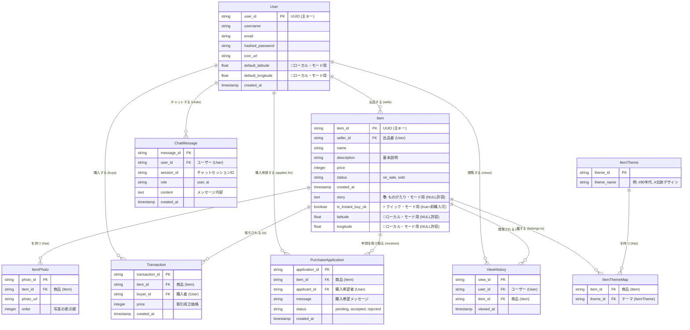

# FleaMarketApp

多様なニーズに応えるために，様々なモードを実装したフリマアプリを考案

## 1. 効率厨のための「クイック・モード」

### コンセプト
検索から購入までの「時間」と「手間」を最小化する。

### UI/UXの変化

* **ビューの変更:** 標準の「画像グリッド」表示から、「詳細リスト」表示（画像は小さく、価格・送料・発送までの日数・商品状態を一覧表示）をデフォルトにする。
* **ノイズの排除:** 「SOLD」の商品は自動的に非表示。
* **専用フィルター:** 「値下げ交渉不可」「即購入可」のアイテムのみを表示するトグルを常時ONにする。

### モード専用機能

* **一括購入リスト:** 買いたいものを一度リストに追加し、複数の出品者から（個別に）一括で購入処理を進められる機能。
* **AI価格チェッカー:** 商品ページに「相場チェック」ボタンを配置。AIが過去の取引相場を即座に提示し、価格交渉の必要性を判断させる。

---

## 2. 思い出の品のための「ものがたり・モード」（実装しない方針に変更)

### コンセプト
価格ではなく「物語」と「共感」でマッチングする。

### UI/UXの変化

* **UIの反転:** 価格や商品スペックよりも、出品者の書いた「アイテムとのエピソード」欄を前面に出す。価格はあえて小さく表示する。
* **「いいね」の変更:** 「いいね！」ボタンを「共感する」ボタンに変更する。

### モード専用機能

* **購入申請システム:** このモードでの出品は、すべて「即購入不可」になる。購入希望者は「なぜ私が次の持ち主としてふさわしいか」を伝えるメッセージを送る必要があり、出品者がそれを見て購入者を「選ぶ」ことができる。
* **「その後」の報告:** 購入後、購入者が「このアイテムを今こうして使っています」と（任意で）出品者に報告できる機能。

---

## 3. 発見を楽しむための「ディスカバー・モード」

### コンセプト
目的買いではなく、偶然の出会い（セレンディピティ）を最大化する。

### UI/UXの変化

* **操作方法の変更:** 検索バーやカテゴリを隠す。TinderやTikTokのような、全画面でのスワイプUI（興味あり/なし）で、ランダムにレコメンドされる商品を見ていく。
* **「ランダムジャンプ」ボタン:** 押すたびに、自分の閲覧履歴とは全く関係のないカテゴリのアイテムをランダムに表示する。

### モード専用機能

* **ミステリーボックス:** 出品者が「〇〇系アイテム詰め合わせ（中身は秘密）」といった「福袋」を専門に出品・検索できるカテゴリを新設する。
* **テーマ・クルーズ:** 「#90年代」「#北欧デザイン」「#奇妙な置物」など、AIや運営がキュレーションした「テーマ」をザッピングしていく。

---

## 4. LLMと買い物する「ともだち・モード」（AIエージェント・モード）

### コンセプト
買い物という「行為」そのものを、AIとの「対話」によって楽しむ。

### UI/UXの変化

* **インターフェースの変更:** アプリのメイン画面が、商品リストではなく「チャットUI」になる。
* **操作方法の変更:** ユーザーは検索窓にキーワードを入れるのではなく、AIエージェントに話しかける。
    > 例：「なんか面白いTシャツない？」
    >
    > 例：「友達の引越し祝いを探してるんだけど、予算5000円で何かいい案ない？」

### モード専用機能

* **AIによる対話型検索:** AIが「面白いTシャツですね。どんなジャンルが好きですか？（笑える系、アート系、ビンテージ系など）」と質問を返し、対話を通じて絞り込んでくれる。
* **LLMによる出品・交渉サポート:**
    * **出品時：** 商品の写真を撮ると、AIが説明文やタイトル、推奨価格を「友達のように」提案してくれる。
    * **購入時：** 価格交渉のメッセージ文面をAIが「（相手が不快にならないように）一緒に考えてくれる」。

---

## 5. 【追加提案】ご近所さん限定「ローカル・モード」（実装しない方針に変更)

### コンセプト
配送（送料・梱包）の手間をゼロにし、地域コミュニティで完結させる。

### UI/UXの変化

* **マップベース検索:** 標準のリスト表示ではなく、「地図」をメインUIにする。
* **距離での絞り込み:** 「半径1km以内」「〇〇駅周辺」での絞り込みが基本となる。

### モード専用機能

* **手渡し専用:** このモードでは、決済はアプリで行うが、配送方法は「手渡し」のみに限定される。
* **受け渡しチャット:** 購入後、安全な受け渡し場所（例：駅の改札前、コンビニ前）と日時を調整するための専用チャットが起動する。




```plaintext
fream-app/  (← あなたのプロジェクトのルートフォルダ)
│
├── .gitignore          # Gitで無視するファイル
├── README.md           # プロジェクトの説明書
│
├── frontend/           # (VercelでデプロイするReact側)
│   │
│   ├── public/         # HTMLや画像などの静的ファイル
│   │   └── index.html
│   │
│   ├── src/            # Reactのソースコード
│   │   │
│   │   ├── api/        # バックエンドAPIを叩く関数群 (例: fetchItems)
│   │   │   └── apiClient.js
│   │   │
│   │   ├── components/ # 再利用可能なUI部品 (例: Button.js, ItemCard.js)
│   │   │
│   │   ├── contexts/   # グローバルな状態管理 (例: AuthContext.js, ModeContext.js)
│   │   │
│   │   ├── hooks/      # カスタムフック (例: useAuth.js)
│   │   │
│   │   ├── pages/      # 各ページのコンポーネント (例: Home.js, ItemDetail.js)
│   │   │
│   │   ├── modes/      # 💎モードごとの専用コンポーネント (オプション)
│   │   │   ├── QuickModeView.js
│   │   │   └── StoryModeView.js
│   │   │
│   │   ├── App.js      # アプリ本体 (ルーティングなど)
│   │   └── index.js    # エントリーポイント
│   │
│   ├── package.json    # フロントエンドの依存ライブラリ (Reactなど)
│   └── vercel.json     # Vercel用のデプロイ設定
│
└── backend/            # (Cloud RunでデプロイするFastAPI側)
    │
    ├── app/            # 👈 メインのPythonアプリケーションコード
    │   │
    │   ├── api/        # 📡 APIエンドポイント (ルーター)
    │   │   ├── v1/
    │   │   │   ├── endpoints/
    │   │   │   │   ├── items.py    # (GET /api/v1/items など)
    │   │   │   │   ├── users.py
    │   │   │   │   └── chat.py     # (POST /api/v1/chat ともだちモード用)
    │   │   │   └── api.py      # v1ルーターを束ねるファイル
    │   │
    │   ├── core/       # ⚙️ 設定ファイル
    │   │   └── config.py   # (DB接続情報, Gemini APIキーの読み込み)
    │   │
    │   ├── db/         # 🗄️ データベース関連
    │   │   ├── models.py   # (ER図で定義したテーブルモデル: User, Item)
    │   │   └── session.py  # (Cloud SQLへの接続セッション管理)
    │   │
    │   ├── schemas/    # 📝 データの型定義 (Pydanticモデル)
    │   │   ├── item.py     # (ItemCreate, ItemResponse など)
    │   │   └── user.py
    │   │
    │   ├── services/   # 🧠 ビジネスロジック
    │   │   ├── item_service.py # (モードに応じた複雑な商品検索ロジック)
    │   │   └── llm_service.py  # (Gemini APIと連携するロジック)
    │   │
    │   └── main.py     # ✨ FastAPIアプリの起動ファイル
    │
    ├── Dockerfile      # Cloud Run用のコンテナイメージ設定
    ├── requirements.txt  # バックエンドの依存ライブラリ (FastAPI, SQLAlchemy)
    └── .gcloudignore   # Cloud Runデプロイ時に無視するファイル
```

# FleaMarketApp 開発TODOリスト (7-Week Plan)

週20時間 (合計140時間) の稼働を前提とした開発ロードマップです。

---

## Week 1: 基盤構築とデプロイ (Total: 20h)

**目標:** 全技術スタック (React, FastAPI, Cloud SQL) を本番環境 (Vercel, Cloud Run) にデプロイし、疎通確認を完了させる。

- [ ] **Backend (FastAPI) (4h):** `main.py` に `/api/v1/ping` を実装し、`Dockerfile` と `requirements.txt` を準備する。
successを表示する関数を作成
- [ ] **Database (Cloud SQL) (4h):** GCPでPostgreSQLインスタンスを起動し、VPCコネクタを設定する。
導通チェック
- [ ] **Backend (連携) (3h):** `config.py`, `session.py` (SQLAlchemy) を設定し、DB接続テスト用の `/api/v1/test-db` を実装する。
SQLAlchemyはよくわからないから，別の方法があるはず
- [ ] **Frontend (React) (4h):** Reactプロジェクトを作成し、`/api/v1/test-db` を叩くテストボタンを実装する。
- [ ] **Deploy (5h):** FastAPIをCloud Runに、ReactをVercelにデプロイし、CORS設定を行う。

---

## Week 2: 商品一覧と認証基盤 (Total: 20h)

**目標:** 商品データをDBから取得・表示する。JWTによる認証（登録・ログイン）のバックエンドを完成させる。認証はJWTでなく，FireBaseにする．最悪，DataBaseにしましょう

- [ ] **DB (Models) (3h):** `backend/app/db/models.py` に `User` と `Item` モデルを定義する。
- [ ] **Backend (Seeding) (2h):** 開発用にダミーの `Item` データを投入するスクリプトを作成・実行する。
- [ ] **Backend (API) (4h):** `GET /api/v1/items`（全商品一覧）と `GET /api/v1/items/{item_id}`（商品詳細）を実装する。
- [ ] **Frontend (UI) (5h):** `pages/HomePage.js` で商品グリッドを表示し、`react-router-dom` で詳細ページへのルーティングを設定する。
- [ ] **Backend (Auth) (6h):** `POST /register`（登録）, `POST /token`（ログイン）を実装し、JWTトークン発行ロジックを完成させる。（JWTはいらない．）
JWTトークンは，ユーザー名役割idなどから生成される鍵の文字列

---

## Week 3: 認証・出品・購入・マイページ (MVPコア完成) (Total: 20h)

**目標:** 認証フローをフロントと連携し、MVPのコア機能（出品・購入・履歴表示）をすべて実装する。

- [ ] **Frontend (Auth) (5h):** `pages/RegisterPage.js`, `LoginPage.js` を作成し、`contexts/AuthContext.js` でトークンをグローバルに管理する。
- [ ] **Backend (Auth) (3h):** FastAPIに「認証必須」のDependency (`get_current_user`) を定義する。
- [ ] **Backend (API) (4h):** `POST /api/v1/items`（商品出品）を実装し、認証ユーザーを `seller_id` として保存する。
- [ ] **Frontend (UI) (3h):** `pages/ItemCreatePage.js`（出品フォーム）を作成する。
- [ ] **Backend/Frontend (Core) (5h):** `Transaction` モデルをDBに定義し、`POST /items/{id}/buy`（決済なし購入）を実装。`MyPage.js` と関連API（出品・購入履歴）を実装する。

---

## Week 4: 画像アップロード (A) と 決済 (D) のバックエンド (Total: 20h)

**目標:** フリマアプリの必須機能である画像アップロードを実装し、最も複雑な決済処理のバックエンドを構築する。FireBaseで画像機能を実装することができるらしい

- [ ] **(A) 画像 (GCS) (2h):** Cloud Storage バケットを作成する。
- [ ] **(A) 画像 (Backend) (4h):** `ItemPhoto` モデルをDBに定義し、GCSに画像をアップロードする `/upload` エンドポイントを実装する。
- [ ] **(A) 画像 (Frontend) (4h):** 出品フォームで画像選択・アップロードを実装し、商品一覧・詳細ページで画像を表示するよう改修する。
- [ ] **(D) 決済 (Backend) (5h):** Stripe SDKを導入し、`POST /items/{id}/create-payment-intent`（決済情報生成）を実装する。
- [ ] **(D) 決済 (Webhook) (5h):** 【最重要】Stripe Webhook (`POST /webhooks/stripe`) を実装し、決済完了イベント受信時に `Transaction` 作成と `Item` 更新を行うよう、購入ロジックを書き換える。

---

## Week 5: 決済 (D) のフロントエンド と エンゲージメント (B, C) (Total: 20h)

**目標:** 決済フローをフロント側で完成させ、いいね・コメント機能を追加する。購入フロー（決済API連携は不要）なので，実際に購入される部分は作り込まなくていい．ただし，購入されたものがsoldになったりと，購入することで変化するべきものは変わるように実装

- [ ] **(D) 決済 (Frontend) (7h):** `react-stripe-js` を導入。購入ボタンクリック後、Stripeの決済フォーム（Elements）を表示し、決済を実行する。
- [ ] **(B) いいね (Backend/Frontend) (7h):** `UserLike` テーブルをDBに定義。いいね追加/削除APIと、フロントの「いいねボタン」を実装・連携させる。
- [ ] **(C) コメント (Backend/Frontend) (6h):** `Comment` テーブルをDBに定義。コメント投稿/一覧取得APIと、商品詳細ページのコメント欄・投稿フォームを実装する。

---

## Week 6: ディスカバー・モード (F) (Total: 20h)

**目標:** スワイプUIを実装し、レコメンドロジック (V1, V2) を構築する。

- [ ] **(F) DB (Swipe) (2h):** スワイプ履歴 `SwipeHistory` テーブルを定義する。
- [ ] **(F) Frontend (UI) (5h):** `react-tinder-card` 等のスワイプUIライブラリを導入し、専用ページを実装する。
- [ ] **(F) Backend (API) (3h):** `POST /items/swipe`（スワイプ結果保存）エンドポイントを実装する。
- [ ] **(F) Backend (Logic V1) (4h):** `GET /items/discover` を実装。「未スワイプ」「未購入」「他人出品」のアイテムをランダムに返すロジックを実装する。
- [ ] **(F) Backend (Logic V2) (6h):** （V1を高度化）`SwipeHistory` や `UserLike` を基に、`scikit-learn` 等を使ったシンプルな協調フィルタリングのロジックを実装する。

---

## Week 7: ともだち・モード (G) と 最終調整 (Total: 20h)

**目標:** Gemini APIと連携したチャットUIを実装し、RAGによる対話型検索を完成させ、発表に向けた最終調整を行う。

- [ ] **(G) API & DB (3h):** Gemini API (Vertex AI または Google AI SDK) を有効化し、SDKをFastAPIに導入。`ChatMessage` テーブルを定義する。
- [ ] **(G) Frontend (UI) (4T):** チャット専用UI（メッセージ履歴、入力欄）を実装する。
- [ ] **(G) Backend (Chat) (5h):** `POST /api/v1/chat` エンドポイントを実装し、過去の会話履歴と共にGemini APIと通信する。
- [ ] **(G) Backend (RAG) (6h):** Geminiの **Function Calling** を活用し、「商品検索」「推薦(F)」など既存の `item_service` の関数をAIが呼び出せる「道具（ツール）」として定義・連携する。
- [ ] **Buffer / 最終調整 (2h):** 全機能の結合テスト、デプロイ確認、軽微なバグ修正を行う。


実装の手順


